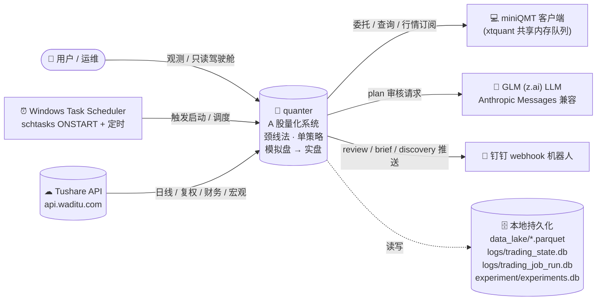

> 最近复核：2026-08-08 · 维护者：wayfinder-session ·
> 权威归宿：**外部系统边界与集成入口**（单一归宿）。模块内部结构见 [#2](02-module-dependencies.md)。

# #1 系统上下文（借 C4-L1 idiom）

quanter 作为整体（黑盒）与其外部 actors / 系统之间的边界。**不展开内部**（内部结构是 [#2](02-module-dependencies.md) 的职责）；这是 C4-L1 的 idiom 借用，非采用完整 C4 模型（[T0 Decisions](../../plans/wayfinder/T0.md) (b)）。

## 图

## 边界逐项

| 外部系统 | 方向 | 入口符号（包） | 关键事实 / 风险 |
|---|---|---|---|
| **Tushare API** | 入（数据） | `data/tushare_sync.py` · `data/lake_reader.py` | 国内直连（[T15](../../plans/wayfinder/T15.md) 移除 ALL_PROXY 后验证）；**唯一数据源**（AKShare/JQData 已退役）；积分限频 |
| **miniQMT + xtquant** | 出（订单/查询）/ 入（回报/行情） | `broker/qmt.py` `QmtExecutionGateway.connect/submit_order` | 共享内存队列、**同 sid 单进程独占、一次性连接、无内置心跳/重连**（[T4](../../plans/wayfinder/T4.md)）；模拟盘不扣 cash、拒涨停价买单、撤单主推延迟 1-2s（业务机制非连接 bug） |
| **钉钉 webhook** | 出（播报） | `broadcast/` 多机器人（review / brief / discovery） | 三类推送；幂等由 `job_ledger` 守（[data-source-of-truth](../data-source-of-truth.md) 第 8 域） |
| **Windows Task Scheduler** | 入（触发） | `ops/`（`start_server.bat` ONSTART → uvicorn :8000；`data_pipeline` 定时 → sync） | schtasks 新进程读 User+Machine env 合成（[T15](../../plans/wayfinder/T15.md) 已清 ALL_PROXY） |
| **GLM (z.ai) LLM** | 出（审核） | `infra/llm/glm.py` `GlmClient.call` | Anthropic Messages 兼容端点（`api.z.ai/api/anthropic/v1/messages`）；凭证 `GLM_API_KEY`；用于 plan 审核服务 |
| **用户/运维（浏览器）** | 入（观测） | `presentation/server`（FastAPI :8000）+ `presentation/web`（Vue 只读） | 前端**只读**（[trading.ts](../../presentation/web/src/api/trading.ts) 无写函数）；写需求走 pre_open cron 或 `trading/tools/trigger_pre_open_once.py` |
| **本地持久化**（系统边界，非外部） | 读/写 | `data_lake/*.parquet` · `logs/trading_state.db` · `logs/trading_job_run.db` · `experiment/experiments.db` | SSoT 真相源集，详见 [data-source-of-truth](../data-source-of-truth.md) 与 [#7](07-ssot-data-layer.md) |

## 进出 quanter 的关键流（高层预览，详见 [#3](03-data-flow.md)）

- **数据入**：Tushare → 采集 → data_lake（parquet）
- **信号→订单**：lake → 策略扫号 → 计划 → broker → miniQMT
- **回报→对账**：miniQMT → broker 回推 → state_store → 对账 → 持仓
- **播报出**：state_store → broadcast → 钉钉
