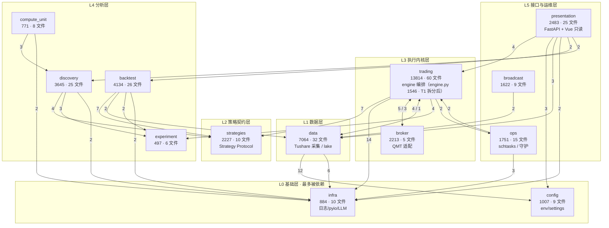
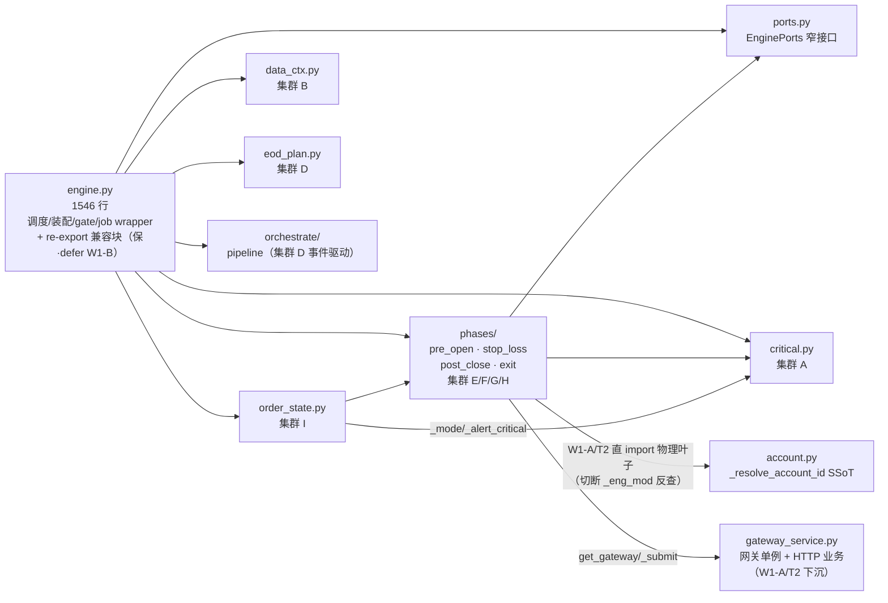

> 最近复核：2026-08-14 · 维护者：glm-5.3-session ·
> 权威归宿：**模块/包清单 + 包间依赖**（单一归宿）。债务判定见 [#6](06-tech-debt.md)；engine 内部见 [deep-dives/engine-current-state](deep-dives/engine-current-state.md)。

# #2 模块边界 + 依赖图

13 个顶层包的边界、规模、与**包间 import 依赖**。数据源：包间 Python `import`/`from` 扫描（**2026-08-14 全量复跑**，文末脚本可复跑）。**边权 = 导入该包的文件数**（≥2 画入下图，=1 列文末次要边）。

> 2026-08-08→08-14 漂移注记：G 波加固推高 `trading→infra` 11→14、`trading→strategies` 5→7；M1 日历下沉使 `data→trading` 2→1；P0-P6 优化波使 discovery 2942→3645 行；caisen 删除使 presentation 3049→2483 行；新增次要边 `broker→ops:1`、`discovery→data:1`。`trading→presentation=0` 复核成立（W1-A 成果未回退）。

## 依赖图（按层分组）



> 节点标签：`包名 · 行数 · .py 文件数 · 职责`。边标签：导入文件数（边权）。双向边 `A <-->|x / y| B` 表示 A→B 权 x、B→A 权 y。

## 中枢分析

**fan-in 最多（被依赖最重 → 基础设施）**：
- `infra`（8 包入边：trading 14 / data 6 / ops 3 / presentation 2 / backtest 2 / discovery 2 / compute_unit 2 / broker 1）— **真·地基**：日志 / pyio / LLM 全员依赖（G 波加固使 trading 侧 11→14）。
- `config`（data 12 / presentation 3 / backtest 1 / broadcast 1）— 配置中枢，**data 强耦合**（12 文件读 settings）。
- `strategies`（trading 7 / backtest 7 / discovery 4）— 策略契约层（`Strategy` Protocol），三类执行主体共用。

**fan-out 最多（依赖他人最重 → 编排中枢）**：
- `trading`（出 7 边：infra / strategies / broker / data / experiment / ops / broadcast）— **编排核心**：全系统唯一负责「采集→信号→计划→订单→对账」完整闭环的包；体量最大（13814 行 / 60 文件）。engine.py 经 **T1 模块化拆分（2026-08-10 完成）**从 3437 行收缩至 1546 行（-55%），8 集群外迁为独立子模块，`_ACTIVE_ENGINE` 单例桥清零；**W1-A/T2（2026-08-12 完成）**切断 trading→presentation 反查（`trading_service` 下沉 `trading/gateway_service`），出边由 8 减至 7；**G 波（2026-08-13/14）**在包内新增 compute/ 适配（breaker/risk/plan 单源化）与 io/breaker 撤单副作用，行数 +1700。内部结构见 [deep-dives/engine-current-state](deep-dives/engine-current-state.md)（已转为拆分前历史态）。
- `presentation/server`（出 7 边）— 只读 API 聚合层，跨包读多。

### trading 内部依赖（T1 拆分后 · 2026-08-10 / W1-A/T2 反查切断 · 2026-08-12）

engine.py 拆分后，trading 包内 engine 与 8 个外迁子模块 + phases/ 包的单向依赖如下（re-export 兼容块保公共 API 不变形）：



> 读图：engine → 8 子模块 + phases/ + orchestrate/ 全程**单向**（phases/ 不反向 import engine，依赖经 `EnginePorts` 显式注入）；order_state → phases.exit（止盈挂单）经 engine re-export 桥接，无循环。`_ACTIVE_ENGINE` 单例桥消除后，模块级函数经 ports 窄接口收 engine 实例特有依赖（盘前三段闸 gate + `_dynamic_whitelist` 注入/清空）。
>
> **W1-A/T2 反查切断（2026-08-12）**：phases/ 与 order_state 原「函数内 lazy `import trading.engine as _eng_mod` 反查 engine 模块级符号」**已全量退役**——19 符号改为顶部直接 import 物理真身叶子（`critical` / `gateway_service` / `account` / `io.breaker` / `compute.stop|breaker` / phases 同包互调），engine 模块不再作为符号中转站。engine.py re-export 兼容块**保留**（engine 内部 wrapper 仍经模块全局名解析命中 re-export 别名，删则破内部调用 + engine 路径测试；彻底删除 defer W1-B）。验收：`grep _eng_mod trading/ tests/ --include=*.py` = 0；360 处测试 patch 迁物理路径（tests/trading/ 全量 + tests/e2e_long_cycle/probabilistic_broker.py）。

## 双向耦合（重构缝合点候选 — T1 / T2 重点观察）

| 耦合对 | 边权 | 物理解释 | 拆分含义 |
|---|---|---|---|
| `trading ↔ broker` | 5 / 3 | engine 调 broker 下单；broker 回调 engine 写 trade_event / state_store | broker→trading 的回写是 **T2 适配层契约**的核心切点（[T2](../../plans/wayfinder/T2.md)） |
| `trading ↔ data` | 4 / 1 | engine 读 data/lake；data 反查 trading（service 状态等，M1 后仅余 1 文件） | 中等耦合且持续收敛；M1（fetch_trade_cal 下沉 `data/calendar.py`）已切断函数级循环 |
| ~~`trading ↔ presentation`~~ → **✅ 单向（W1-A/T2 · 2026-08-12）** | ~~2 / 3~~ → **0 / 4** | server 起 engine；原 engine/phases/order_state/io.orders 反引 `presentation/.../trading_service`（领域层依赖表现层·分层违例） | **已切断**：`trading_service.py` 下沉 `trading/gateway_service.py`，trading→presentation 边权 2→0；presentation→trading 仍 4（单向被依赖合法）。`import` 扫描实证 0 命中（08-14 复跑仍 0） |

> 双向耦合不一定是债——但每个都是 T1（engine 拆分）必须显式处理的缝合点。**债务严重度判定归 [#6](06-tech-debt.md)**。

## 次要边（=1 文件，未画入图）

```
backtest→config:1 · backtest→trading:1 · broadcast→backtest:1 · broadcast→config:1
broadcast→experiment:1 · broadcast→presentation:1 · broadcast→trading:1 · broker→infra:1
broker→ops:1 · data→strategies:1 · discovery→backtest:1 · discovery→compute_unit:1
discovery→data:1 · ops→backtest:1 · ops→presentation:1 · presentation→broadcast:1
presentation→broker:1 · presentation→ops:1 · trading→broadcast:1
```

## 规模一览（行数 / .py 文件数 · 2026-08-14 扫描）

| 包 | 行 | 文件 | 包 | 行 | 文件 |
|---|---|---|---|---|---|
| trading | 13814 | 60 | strategies | 2227 | 10 |
| data | 7064 | 32 | broadcast | 1622 | 9 |
| backtest | 4134 | 26 | ops | 1751 | 15 |
| presentation | 2483 | 25 | config | 1001 | 9 |
| discovery | 3645 | 25 | infra | 884 | 10 |
| broker | 2213 | 5 | compute_unit | 771 | 8 |
|  |  |  | experiment | 497 | 6 |

**合计 ≈ 42.1k 行 · 240 .py 文件**（13 顶层包）。08-08→08-14 主要增量：trading 12090→13814（G 波加固：compute/ 单源化 + io/breaker + gateway_service 下沉吸收）、data 6400→7064、discovery 2942→3645（P0-P6 优化波）；presentation 3049→2483（服务端路由收敛；另 caisen 删除清掉前端 −1943 行 .ts/.vue，不计入本表 .py 口径）。

## 复跑扫描（新增 import 边时重跑核对·单一归宿保真）

```bash
python - <<'PY'
import os, re
PKGS=["trading","data","discovery","backtest","broker","strategies","ops","infra","broadcast","config","compute_unit","experiment","presentation"]
pat=re.compile(r'^\s*(?:from|import)\s+('+'|'.join(PKGS)+r')\b')
edges={}
for src in PKGS:
    for root,dirs,files in os.walk(src):
        dirs[:]=[d for d in dirs if d!='__pycache__' and not d.startswith('.')]
        for f in files:
            if not f.endswith('.py'): continue
            try:
                for line in open(os.path.join(root,f),encoding='utf-8'):
                    m=pat.match(line)
                    if m and m.group(1)!=src:
                        edges.setdefault((src,m.group(1)),set()).add(f)
            except: pass
for (s,d),fs in sorted(edges.items(),key=lambda x:(-len(x[1]),x[0])):
    print(f"{s} -> {d} : {len(fs)}")
PY
```
