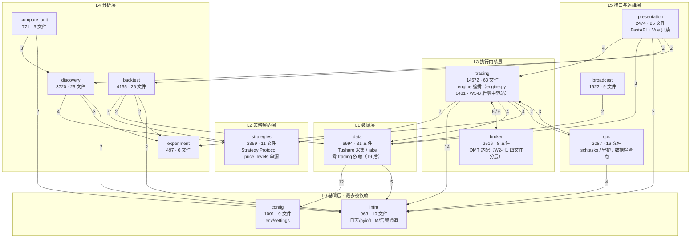
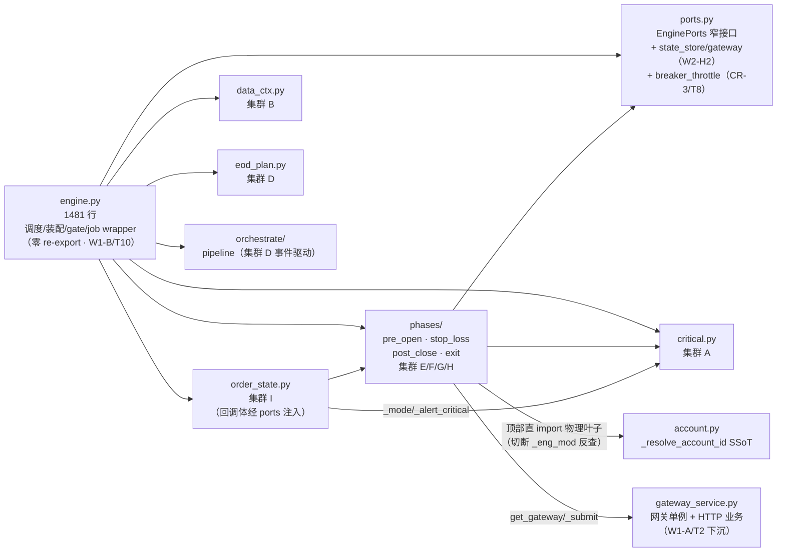

> 最近复核：2026-08-15 · 维护者：debt-full-wave session ·
> 权威归宿：**模块/包清单 + 包间依赖**（单一归宿）。债务判定见 [#6](06-tech-debt.md)；engine 内部见 [deep-dives/engine-current-state](deep-dives/engine-current-state.md)。
> 波次记录：`debt/full-wave-0815`（T1-T17 · 2026-08-15）——W1-B re-export 删除 / W2 broker 四文件分层 / TD data→trading 边清零 / CR 族清偿；本文件为该波次后全量复跑刷新。

# #2 模块边界 + 依赖图

13 个顶层包的边界、规模、与**包间 import 依赖**。数据源：包间 Python `import`/`from` 扫描（**2026-08-15 全量复跑**，文末脚本可复跑）。**边权 = 导入该包的文件数**（≥2 画入下图，=1 列文末次要边）。

> 2026-08-14→08-15 漂移注记（debt/full-wave-0815）：**`data→trading` 1→0（TD/T9 边清零——检查点入口 run_data_check 迁 ops/，日历函数下沉 data/calendar.py）**；W2-H1/T13 broker 四文件分层使 `trading↔broker` 5/3→**6/6**（qmt_connection/qmt_io/qmt_business 各自独立 import 记账）、`broker→infra` 1→2；T9 迁移连带 `ops→trading` 2→3、`ops→data` +1（=1 入次要边）、`data→infra` 6→5；T13/T14 断 broker-first 潜伏 import 环（gateway_service OrderResult TYPE_CHECKING 化，两种加载序均通过，回归哨 tests/test_import_order.py）；T16 macro 收缩使 `presentation→config` 3→2；**08-14 记载的 `presentation→broker:1` 复跑零命中（git grep master/HEAD 双证——记载失准，订正删除）**。`trading→presentation=0` 复核成立（W1-A 成果未回退）。

## 依赖图（按层分组）



> 节点标签：`包名 · 行数 · .py 文件数 · 职责`。边标签：导入文件数（边权）。双向边 `A <-->|x / y| B` 表示 A→B 权 x、B→A 权 y。**data 无任何指向 trading/L3+ 的出边**（T9 后全量扫描零命中）。

## 中枢分析

**fan-in 最多（被依赖最重 → 基础设施）**：
- `infra`（8 包入边：trading 14 / data 5 / ops 4 / presentation 2 / backtest 2 / discovery 2 / compute_unit 2 / broker 2）— **真·地基**：日志 / pyio / LLM / 告警通道全员依赖（T4 LocalFileChannel 双通道落此包）。
- `config`（data 12 / presentation 2 / backtest 1 / broadcast 1）— 配置中枢，**data 强耦合**（12 文件读 settings）。
- `strategies`（trading 7 / backtest 7 / discovery 4）— 策略契约层（`Strategy` Protocol + T7 后 `price_levels` 单源），三类执行主体共用。

**fan-out 最多（依赖他人最重 → 编排中枢）**：
- `trading`（出 7 边：infra / strategies / broker / data / experiment / ops / broadcast）— **编排核心**：全系统唯一负责「采集→信号→计划→订单→对账」完整闭环的包；体量最大（14572 行 / 63 文件）。engine.py 演进链：T1 拆分 3437→1546（08-10）→ W1-A/T2 反查切断（08-12）→ **W1-B/T10 re-export 块删除（08-15）现 1481 行**，纯调度/装配/gate/job wrapper + 15 行自用直 import，零符号中转站。W2-H2 回调 Ports 化后 order_state 副作用经 `EnginePorts.state_store/gateway` 显式注入。
- `presentation/server`（出 7 边）— 只读 API 聚合层，跨包读多。

### trading 内部依赖（W1-B 后 · 2026-08-15 终态）

engine.py 与子模块的单向依赖（**re-export 兼容块已删**——engine 不再是任何符号的中转站）：



> 读图：engine → 子模块 + phases/ + orchestrate/ 全程**单向**（phases/ 不反向 import engine，依赖经 `EnginePorts` 显式注入）。W1-A/T2（08-12）已退役全部 `_eng_mod` 反查（19 符号改顶部直 import 物理叶子）；**W1-B/T10（08-15）删除 re-export 兼容块**——直 import 后的自用绑定名仍是 engine 模块属性，`patch("trading.engine.<自用名>")` 命中语义不变（T17 孤儿 patch 审计：活代码 27 符号全在位，孤儿 = 0）。M2/T11 `StopLossContext` 单参装箱 stop_loss_monitor 三 map。

### broker 内部结构（W2-H1/T13 四文件分层 · 2026-08-15）

```
broker/
├── qmt_connection.py  1025 行  契约根：模块契约/常量（xtquant 容错、11 态、超时/退避）+ 12 辅助函数 + QmtConnectionBase（连接 7 方法 + C++ 回调 8）
├── qmt_io.py           334 行  QmtIoMixin：_fetch_broker_positions/query_asset/get_quote/query_orders/query_trades 等 6 IO 方法
├── qmt_business.py     479 行  QmtBusinessMixin：submit/cancel/回调处理/风控锁等 15 业务方法
├── qmt.py              132 行  类组装 QmtExecutionGateway(三 mixin) + 显式列名 re-export（37 符号，兼容面零变化）
├── base.py             184 行  BaseExecutionGateway/OrderResult/OrderRequest/OrderState 契约
├── qmt_quote.py        211 行  行情独立面
└── mock.py              90 行  概率成交 broker（L3 e2e 载体）
```

> 分层红线：AST 级 53/53 函数体逐字一致（逻辑只搬）；`BrokerProtocol`（trading/broker_ports.py，runtime_checkable 最小契约）钉住六方法 + 回调钩子；logger 名锁定 `broker.qmt`（测试/运维口径零变化）。`_ORDER_TIMEOUT` 跨层 from-import 三拷贝已收口（N5 · Low ③：qmt_io/qmt_business 改 `qmt_connection._ORDER_TIMEOUT` 调用点模块属性访问，patch 统一指契约根，见 [#6 Low 清单](06-tech-debt.md)）。

## 双向耦合（重构缝合点现状）

| 耦合对 | 边权 | 现状 |
|---|---|---|
| `trading ↔ broker` | 6 / 6 | **W2 已收口**（H1 四文件 + H2 回调 Ports 化）：回调体不再反查 engine 实例（经 `ports.state_store/gateway` 显式注入；T13 裁定 gateway 保留——回调体查实例态 `_orders/_seq_to_real`）。边权 5/3→6/6 系四文件分层后各文件独立 import 记账（结构性、非耦合恶化）；broker-first 潜伏 import 环已断（T14，两种加载序均通过） |
| `trading ↔ data` | 4 / **0** | **data→trading 反向边清零（T9 · 2026-08-15）**：`run_data_check` 迁 ops/（检查点本质是 ops 编排件，ops→trading 为 L5→L3 合法单向）+ `expected_latest_trade_day` 下沉 `data/calendar.py`。M1（日历下沉）+ T9 后函数级与文件级反向边双双为零 |
| ~~`trading ↔ presentation`~~ → **✅ 单向（W1-A/T2 · 2026-08-12）** | **0 / 4** | 已切断：`trading_service.py` 下沉 `trading/gateway_service.py`；08-15 复跑 trading→presentation 仍 0 命中（成果未回退） |

> 双向耦合不一定是债——但每个都是 T1（engine 拆分）必须显式处理的缝合点。**债务严重度判定归 [#6](06-tech-debt.md)**。

## 次要边（=1 文件，未画入图）

```
backtest→config:1 · backtest→trading:1 · broadcast→backtest:1 · broadcast→config:1
broadcast→experiment:1 · broadcast→presentation:1 · broadcast→trading:1 · broker→ops:1
data→strategies:1 · discovery→backtest:1 · discovery→compute_unit:1 · discovery→data:1
ops→backtest:1 · ops→data:1 · ops→presentation:1 · presentation→broadcast:1
presentation→ops:1 · trading→broadcast:1
```

（对照 08-14：`ops→data:1` 新入（T9 迁移文件 lazy import 记账）；`presentation→broker:1` 消失——复跑零命中，08-14 记载失准订正。）

## 规模一览（行数 / .py 文件数 · 2026-08-15 扫描）

| 包 | 行 | 文件 | 包 | 行 | 文件 |
|---|---|---|---|---|---|
| trading | 14572 | 63 | strategies | 2359 | 11 |
| data | 6994 | 31 | broadcast | 1622 | 9 |
| backtest | 4135 | 26 | ops | 2087 | 16 |
| presentation | 2474 | 25 | config | 1001 | 9 |
| discovery | 3720 | 25 | infra | 963 | 10 |
| broker | 2516 | 8 | compute_unit | 771 | 8 |
|  |  |  | experiment | 497 | 6 |

**合计 ≈ 43.7k 行 · 247 .py 文件**（13 顶层包）。08-14→08-15 主要增量：trading 13814→14572（CR-3 盘中熔断 + W2-H2 ports + M2 上下文，同时 T10 删 re-export −224 行）；broker 2213→2516（四文件分层 + BrokerProtocol）；ops 1751→2087（run_data_check 迁入 + QuanterAudit 注册）；strategies +132（price_levels 单源）；infra +79（LocalFileChannel）；data 7064→6994（run_data_check 迁出）。

## 复跑扫描（新增 import 边时重跑核对·单一归宿保真）

```bash
python - <<'PY'
import os, re
PKGS=["trading","data","discovery","backtest","broker","strategies","ops","infra","broadcast","config","compute_unit","experiment","presentation"]
pat=re.compile(r'^\s*(?:from|import)\s+('+'|'.join(PKGS)+r')\b')
edges={}
for src in PKGS:
    for root,dirs,files in os.walk(src):
        dirs[:]=[d for d in dirs if d!='__pycache__' and not d.startswith('.')]
        for f in files:
            if not f.endswith('.py'): continue
            try:
                for line in open(os.path.join(root,f),encoding='utf-8'):
                    m=pat.match(line)
                    if m and m.group(1)!=src:
                        edges.setdefault((src,m.group(1)),set()).add(f)
            except: pass
for (s,d),fs in sorted(edges.items(),key=lambda x:(-len(x[1]),x[0])):
    print(f"{s} -> {d} : {len(fs)}")
PY
```
