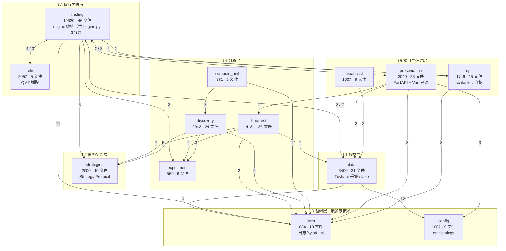

> 最近复核：2026-08-08 · 维护者：wayfinder-session ·
> 权威归宿：**模块/包清单 + 包间依赖**（单一归宿）。债务判定见 [#6](06-tech-debt.md)；engine 内部见 [deep-dives/engine-current-state](deep-dives/engine-current-state.md)。

# #2 模块边界 + 依赖图

13 个顶层包的边界、规模、与**包间 import 依赖**。数据源：包间 Python `import`/`from` 扫描（2026-08-08 全量，文末脚本可复跑）。**边权 = 导入该包的文件数**（≥2 画入下图，=1 列文末次要边）。

## 依赖图（按层分组）



> 节点标签：`包名 · 行数 · .py 文件数 · 职责`。边标签：导入文件数（边权）。双向边 `A <-->|x / y| B` 表示 A→B 权 x、B→A 权 y。

## 中枢分析

**fan-in 最多（被依赖最重 → 基础设施）**：
- `infra`（8 包入边：trading 11 / data 6 / presentation 3 / ops 3 / backtest 2 / discovery 2 / compute_unit 2 / broker 1）— **真·地基**：日志 / pyio / LLM 全员依赖。
- `config`（data 12 / presentation 3 / backtest 1 / broadcast 1）— 配置中枢，**data 强耦合**（12 文件读 settings）。
- `strategies`（backtest 7 / discovery 5 / trading 5）— 策略契约层（`Strategy` Protocol），三类执行主体共用。

**fan-out 最多（依赖他人最重 → 编排中枢）**：
- `trading`（出 8 边：infra / strategies / broker / data / experiment / ops / presentation / broadcast）— **编排核心**：全系统唯一负责「采集→信号→计划→订单→对账」完整闭环的包；体量最大（10620 行，含 god module `engine.py` 3437；内部结构见 [deep-dives/engine-current-state](deep-dives/engine-current-state.md)）。
- `presentation/server`（出 6 边）— 只读 API 聚合层，跨包读多。

## 双向耦合（重构缝合点候选 — T1 / T2 重点观察）

| 耦合对 | 边权 | 物理解释 | 拆分含义 |
|---|---|---|---|
| `trading ↔ broker` | 4 / 3 | engine 调 broker 下单；broker 回调 engine 写 trade_event / state_store | broker→trading 的回写是 **T2 适配层契约**的核心切点（[T2](../../plans/wayfinder/T2.md)） |
| `trading ↔ data` | 3 / 2 | engine 读 data/lake；data 反查 trading（service 状态等） | 中等耦合，T1 engine 拆分时理顺读写方向 |
| `trading ↔ presentation` | 2 / 3 | server 起 engine；engine 反引 presentation（启动期？） | 需核实是否真双向（疑 server↔engine 启动期耦合），T1 验证 |

> 双向耦合不一定是债——但每个都是 T1（engine 拆分）必须显式处理的缝合点。**债务严重度判定归 [#6](06-tech-debt.md)**。

## 次要边（=1 文件，未画入图）

```
backtest→config:1 · backtest→trading:1 · broadcast→backtest:1 · broadcast→config:1
broadcast→experiment:1 · broadcast→presentation:1 · broadcast→trading:1 · broker→infra:1
data→strategies:1 · discovery→backtest:1 · discovery→compute_unit:1 · ops→backtest:1
ops→presentation:1 · presentation→broadcast:1 · presentation→broker:1 · presentation→discovery:1
presentation→ops:1 · trading→broadcast:1
```

## 规模一览（行数 / .py 文件数）

| 包 | 行 | 文件 | 包 | 行 | 文件 |
|---|---|---|---|---|---|
| trading | 10620 | 46 | strategies | 2000 | 10 |
| data | 6400 | 31 | broadcast | 1607 | 9 |
| backtest | 4134 | 26 | ops | 1746 | 15 |
| presentation | 3049 | 25 | config | 1007 | 9 |
| discovery | 2942 | 24 | infra | 884 | 10 |
| broker | 2057 | 5 | compute_unit | 771 | 8 |
|  |  |  | experiment | 569 | 6 |

**合计 ≈ 37.7k 行 · 224 .py 文件**（13 顶层包）。

## 复跑扫描（新增 import 边时重跑核对·单一归宿保真）

```bash
python - <<'PY'
import os, re
PKGS=["trading","data","discovery","backtest","broker","strategies","ops","infra","broadcast","config","compute_unit","experiment","presentation"]
pat=re.compile(r'^\s*(?:from|import)\s+('+'|'.join(PKGS)+r')\b')
edges={}
for src in PKGS:
    for root,dirs,files in os.walk(src):
        dirs[:]=[d for d in dirs if d!='__pycache__' and not d.startswith('.')]
        for f in files:
            if not f.endswith('.py'): continue
            try:
                for line in open(os.path.join(root,f),encoding='utf-8'):
                    m=pat.match(line)
                    if m and m.group(1)!=src:
                        edges.setdefault((src,m.group(1)),set()).add(f)
            except: pass
for (s,d),fs in sorted(edges.items(),key=lambda x:(-len(x[1]),x[0])):
    print(f"{s} -> {d} : {len(fs)}")
PY
```
