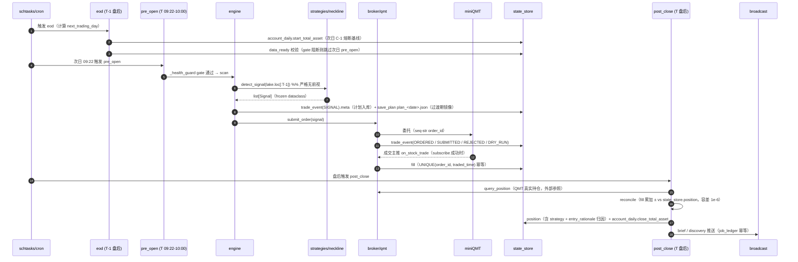
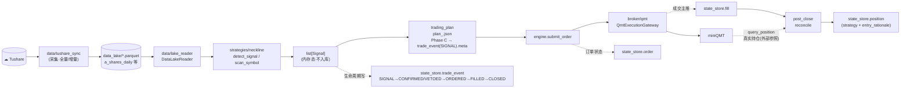

> 最近复核：2026-08-08 · 维护者：wayfinder-session ·
> 权威归宿：**核心数据路径**（单一归宿）。外部边界见 [#1](01-system-context.md)；真相源规则见 [data-source-of-truth](../data-source-of-truth.md) 与 [#7](07-ssot-data-layer.md)；策略算法见 [neckline-method](../neckline-method.md)。

# #3 核心数据流

一条成交从「数据入库」到「落账持仓」的完整路径：**采集 → lake → 信号 → 计划 → 订单 → 成交 → 对账 → 持仓**。两视角：
- **时序图**——单交易日内各阶段的触发与写库顺序；
- **结构图**——数据形态与持久化归宿（每节点链 #7 真相源，不重抄）。

## 时序：单交易日生命周期（T 日）

> 注：subscribe 失败时无主推，订单状态退化为例：`_sync_orders_if_stale` 在触发点前主动 `query_orders` 兜底（[T4](../../plans/wayfinder/T4.md)：不引入后台轮询，惰性补全）。

## 结构：数据路径与真相源归宿

## 阶段—产物—真相源（链 [data-source-of-truth](../data-source-of-truth.md) / [#7](07-ssot-data-layer.md)，不重抄）

| 阶段 | 产物 | 真相源（域） | 关键不变量 |
|---|---|---|---|
| 采集 | `data_lake/*.parquet` | 原始落盘（非 SSoT 域） | 行数骤降即异常（[T12](../../plans/wayfinder/T12.md) 教训） |
| 信号 | `list[Signal]` | 内存态 | 严格无前视 `df.loc[:T]`；持久化经 trade_event |
| 计划 | `plan_<date>.json` / `trade_event(SIGNAL).meta` | **第 6 域**（Phase C 升格中，JSON 当前仍生产写入口） | `UNIQUE(account_id,trade_id,action)` 幂等 |
| 订单 | `state_store.order` | **第 2 域** | order_id PK；状态机 SUBMITTED/FILLED/CANCELED |
| 委托生命周期 | `state_store.trade_event` | **第 4 域** | 动作枚举 SIGNAL/CONFIRMED/VETOED/BLOCKED/ORDERED/SUBMITTED/REJECTED/DRY_RUN/FILLED/CLOSED |
| 成交 | `state_store.fill` | **第 1 域** | `UNIQUE(order_id, traded_time)` 幂等——双写防重 |
| 持仓 | `state_store.position` | **第 3 域** | 含归因列 `strategy`+`entry_rationale`；QMT 持仓是外部对账参照**非内部真相** |
| 日权益/熔断 | `state_store.account_daily` | **第 5 域** | PK(account_id,date)；start=熔断基线 / close=日终闭合 |
| 数据就绪 | `state_store.data_ready` + `job_ledger` | **第 7 域** | `get_ready` 单口读；PK(date,dataset) |
| 播报幂等 | `job_ledger` | **第 8 域** | brief_<bot> 行 begin/finish 成对，独立库 |

## 关键风险点（详见 [#6](06-tech-debt.md)）

- **start_total_asset 漏采**：模拟盘/非盘前启动 → start NULL → 当日 C-1 熔断基线裸奔（pre_open 窗口 `[09:22,10:00)` 内必须起来写 start snap）。
- **撤单主推延迟**：QMT CANCELLED 主推延迟 1-2s，须轮询确认（非数据流 bug，业务机制）。
- **第 6 域过渡态**：Phase C 删 save_plan/load_plan 前 JSON 仍是生产写入口（不违规）；完成后 JSON 降级为按需导出。
