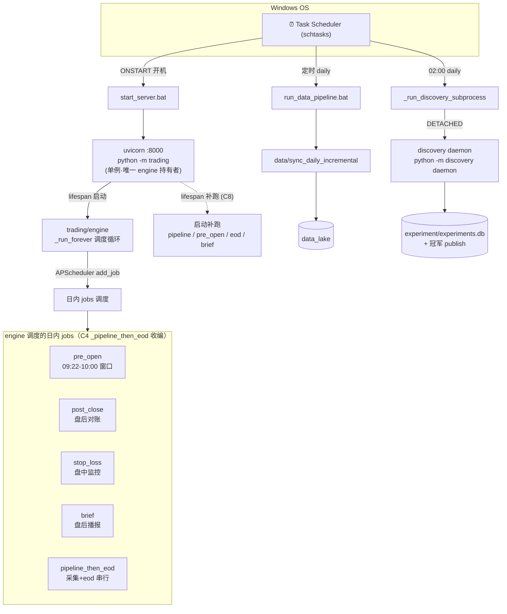

> 最近复核：2026-08-08 · 维护者：wayfinder-session ·
> 权威归宿：**进程模型 / 调度结构**（单一归宿）。外部触发源（schtasks）见 [#1](01-system-context.md)；job 时间窗/时钟语义见 [#8](08-control-time-flow.md)；连接态见 [T4](../../plans/wayfinder/T4.md)；挡板/熔断见 [guardrails.md](../guardrails.md)。

# #4 进程 / 调度拓扑

quanter 的进程模型（单例 uvicorn 持有唯一 engine）、外部调度入口（schtasks）、后台 daemon（discovery）、与启动补跑机制。

## 拓扑图

## 进程模型（C5 单例）

- **唯一 engine 持有者 = uvicorn :8000**（`python -m trading` → `run_server`）。`__main__` 起 uvicorn 消除双进程抢 QMT session（[T4 真根因](../../plans/wayfinder/T4.md)：同 sid 单进程独占）。
- **端口 8000 单例**，无文件锁；`reload=False`（live 期）。
- `_gw_health_gate`（C5）：`_pre_open`/`_stoploss`/`_post_close` 三入口同口径锁态——gate 不过即 skip + CRITICAL（**不停调度**，C4 决议）。

## 外部调度入口（schtasks，C7 收编）

| schtasks 任务 | 触发 | 执行 | 作用 |
|---|---|---|---|
| `QuanterServer` | ONSTART 开机 | `start_server.bat` → `python -m trading` | 起 uvicorn + engine + lifespan（含 connect bots / discovery cron 注册） |
| `data_pipeline` | 定时 daily | `run_data_pipeline.bat` → `sync_daily_incremental` | 数据采集（独立进程，读 schtasks 合成 env——[T15](../../plans/wayfinder/T15.md) 已清 ALL_PROXY） |
| discovery | 02:00 daily | engine APScheduler `add_job` → `_run_discovery_subprocess` | DETACHED `python -m discovery daemon`（与 engine 进程隔离） |

> schtasks 新进程读 **User + Machine 注册表合成 env**（[T15](../../plans/wayfinder/T15.md) 根治点）。

## 启动补跑（C8 lifespan catchup）

uvicorn lifespan 启动时补跑错过的 job（`job_ledger` running/done/skipped/failed 四态 + 启动重置）：
- **补跑范围**：采集 / eod / pre_open / brief。
- **pre_open 窗口** `[09:22, 10:00)`（env 可调）：窗口内补跑；**窗口过只补数据 + CRITICAL**（不补挂单）。
- **brief 兜底**：`.last_<bot>` 文件兜底（B4 后主以 `job_ledger` 为准）。
- **失败不停调度**：留 18:00 cron 收敛。

## 日内 jobs（C4 收编 + 错误分级）

engine 经 APScheduler 调度的日内 jobs，统一走 `_pipeline_then_eod` 收编（C-3 cancel account_id 透传；C-4 错误分级）：

| job | 时段 | 失败分级（C4） |
|---|---|---|
| `pipeline_then_eod` | 盘后 | L1（DB/采集 raise `_CriticalHalt` 停）/ L2（单只拒单聚合 CRITICAL 不停）/ L3 |
| `pre_open` | 09:22-10:00 | gate skip + CRITICAL（不停调度） |
| `stop_loss` | 盘中 | 单只拒单 L2 |
| `post_close` | 盘后 | L1（DB 写）/ L2（业务拒单） |
| `brief` | 盘后 | 播报幂等（job_ledger 第 8 域） |

> 时间窗精确语义（eod 用 `trading_day=next_trading_day(today)`、pre_open 窗口边界）归 [#8](08-control-time-flow.md)。

## 已知韧性缺口（毕业自 T4，待 T9-T11）

- **T9**：`health_guard` 主动探针 watchdog（高优先）。
- **T10**：嵌套父子进程探测（先实证）。
- **T11**：连接韧性收尾（低）。
- 见 [#6](06-tech-debt.md) 技术债视图与 [T4 Resolution](../../plans/wayfinder/T4.md)。
