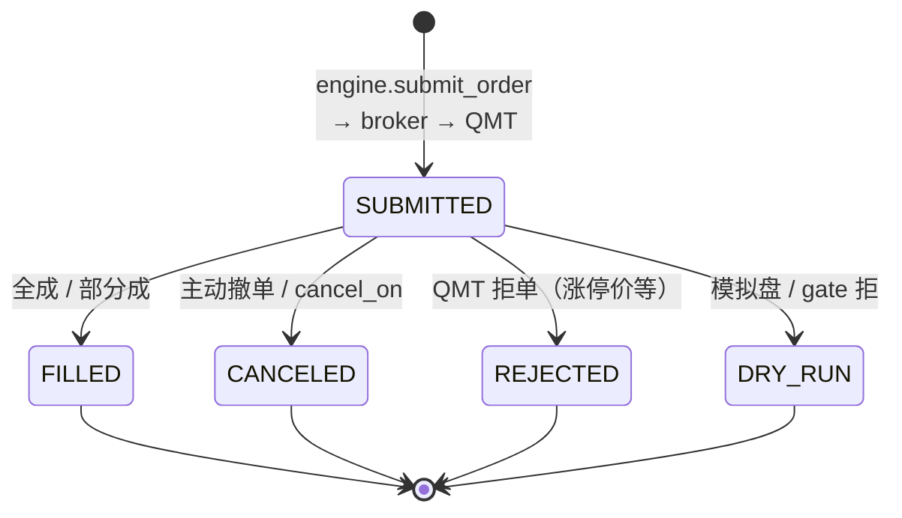
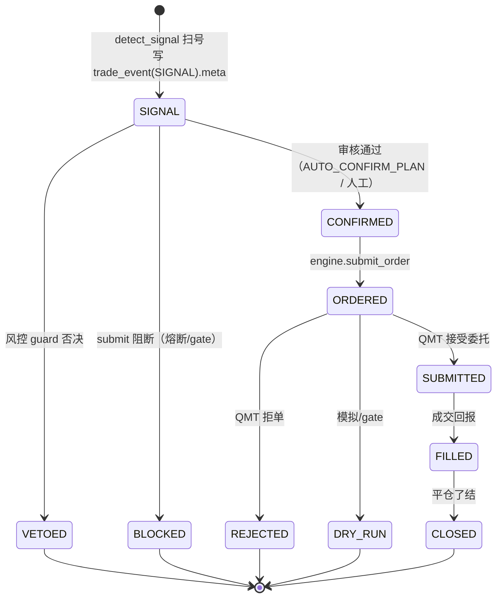
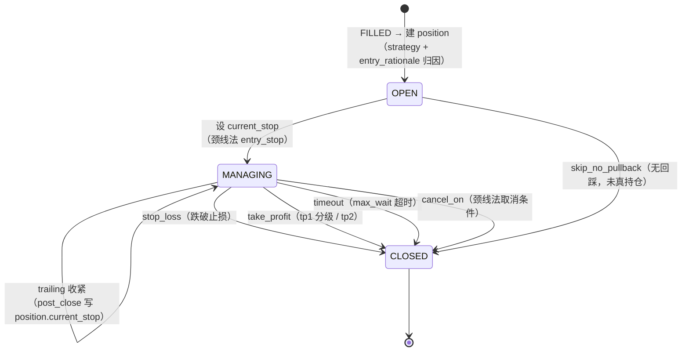

> 最近复核：2026-08-08 · 维护者：wayfinder-session ·
> 权威归宿：**订单/计划/持仓 状态迁移**（单一归宿）。状态枚举源自 [data-source-of-truth](../data-source-of-truth.md) 第 2/3/4 域；精确迁移 guard 条件以代码为准（→ [deep-dives/engine-current-state](deep-dives/engine-current-state.md)）。

# #5 状态机（order / plan / position）

三个交易生命周期状态机。**这是重构踩雷重灾区**——memory 记录的 P1「止损监控静默失效」就是 ORDERED 平移盖 CONFIRMED 的状态机 bug（[SSoT Phase B+C review](../../plans/wayfinder/)）。T1 engine 拆分必须保状态机语义不变形。

## ① order — 委托状态（第 2 域）

> `order_id` PK；状态枚举 `SUBMITTED/FILLED/CANCELED/REJECTED/DRY_RUN`（[data-source-of-truth](../data-source-of-truth.md) 第 2 域）。

## ② plan — 计划/审核生命周期（第 4/6 域，trade_event action）

> `UNIQUE(account_id, trade_id, action)` 幂等。动作枚举：`SIGNAL/CONFIRMED/VETOED/BLOCKED/ORDERED/SUBMITTED/REJECTED/DRY_RUN/FILLED/CLOSED`。
> **P1 教训**：`is_trade_confirmed` 须严格判 `action in {CONFIRMED, ORDERED, SUBMITTED, FILLED}`（ORDERED 平移盖 CONFIRMED 致止损监控静默失效——已修，[SSoT review]）。

## ③ position — 持仓生命周期（第 3 域）

> `exit_reason ∈ {stop_loss, take_profit(tp1/tp2), timeout, cancel_on, skip_no_pullback}`（颈线法 simulate_exit 完整状态机：挂单回踩 + max_wait + cancel_on + 分级止盈；[breakout_quality_analysis](../../backtest/tools/breakout_quality_analysis.py) 实证）。
> **current_stop 单一归宿**：post_close 写 `position.current_stop`，盘中 `_stoploss/pre_open` 读最新（[plan-backtest-live-alignment] memory）。

## 状态机风险（详见 [#6](06-tech-debt.md)）

- **P1 重演面**：任何把「生命周期动作」与「委托状态」混判的逻辑都会重演止损静默失效。T1 engine 拆分须保 `is_trade_confirmed` 三处复用口径一致。
- **trailing 双口径**：颈线法曾有两套 stop（rr 守卫脱节），已统一（[neckline-algorithm-gaps] memory）；T1 须保不回退。
