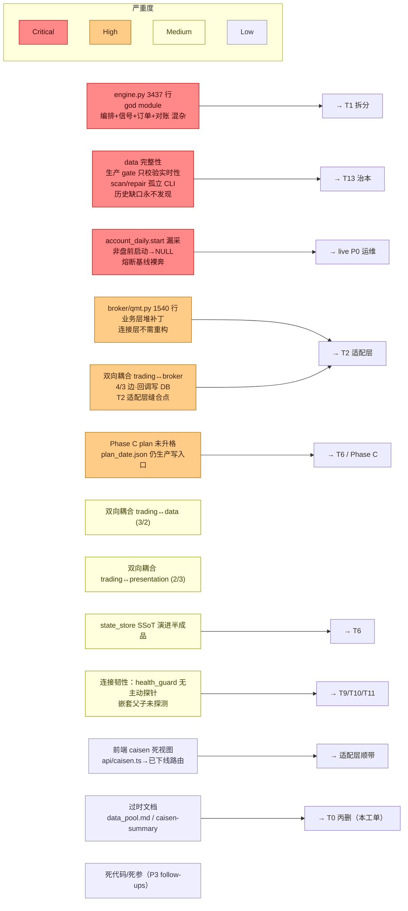

> 最近复核：2026-08-08 · 维护者：wayfinder-session ·
> 权威归宿：**技术债 / 痛点 / god module 判定**（单一归宿）。模块结构（不判债）见 [#2](02-module-dependencies.md)；本视图是 #2 的「债务切片」——只画债-bearing 项 + 严重度，不重复依赖边。

# #6 技术债 / 已知缺口分布

路线图即技术债热力图。严重度四级（Critical / High / Medium / Low），每项链对应 wayfinder 工单（→ 治理归宿）。

## 债务热力图

## 债务清单（按严重度）

### Critical（阻塞 live / 阻塞演进主脊柱）

| 项 | 物理事实 | 治理归宿 |
|---|---|---|
| **engine.py god module（3437 行）** | 编排+信号触发+订单提交+对账+生命周期混于一文件；T1 拆分直接目标。内部结构 → [deep-dives/engine-current-state](deep-dives/engine-current-state.md) | [T1](../../plans/wayfinder/T1.md) |
| **data 完整性 gate 缺陷** | 生产 gate 只校验实时性不校验历史连续性；`scan_integrity`/`repair_gaps` 孤立 CLI 无调度；历史缺口被动跳过永不发现（[T5](../../plans/wayfinder/T5.md)） | [T13](../../plans/wayfinder/T13.md) |
| **account_daily.start 漏采** | 模拟盘/非盘前启动 → `start_total_asset` NULL → C-1 熔断 -3% 基线裸奔 | live P0 运维（pre_open 窗口内必须起） |

### High（演进主脊柱缝合点）

| 项 | 物理事实 | 治理归宿 |
|---|---|---|
| **broker/qmt.py 业务层堆补丁（1540 行）** | 连接层不需重构（[T4](../../plans/wayfinder/T4.md) 裁定）；债在业务层（串通挂撤/拒涨停/撤单延迟的处理逻辑） | [T2](../../plans/wayfinder/T2.md) |
| **双向耦合 trading↔broker（4/3）** | engine 调 broker 下单，broker 回调 engine 写 trade_event/state_store —— T2 适配层契约核心切点 | [T2](../../plans/wayfinder/T2.md) |
| **Phase C plan 未升格** | `plan_<date>.json` 仍是生产写入口（过渡态，不违规）；Phase C 删 save_plan/load_plan 未做 | [T6](../../plans/wayfinder/T6.md) / Phase C |

### Medium（横向治理）

| 项 | 治理归宿 |
|---|---|
| 双向耦合 trading↔data (3/2)、trading↔presentation (2/3) —— T1 engine 拆分时理顺 | [T1](../../plans/wayfinder/T1.md) |
| state_store SSoT 演进半成品（Phase B+C 收口后剩余） | [T6](../../plans/wayfinder/T6.md) |
| 连接韧性：health_guard 无主动探针 watchdog / 嵌套父子进程未探测 | [T9](../../plans/wayfinder/T9.md) / [T10](../../plans/wayfinder/T10.md) / [T11](../../plans/wayfinder/T11.md) |

### Low（清理类）

| 项 | 治理归宿 |
|---|---|
| 前端 caisen 死视图（`presentation/web/src/api/caisen.ts` → 已下线后端路由，首页 `/caisen` 空态） | T2 适配层顺带 / 独立清理 |
| 过时文档 `data_pool.md` / `caisen-methodology-summary.md` | **本工单 T0 丙删** |
| 死代码 / 死参数（P3 follow-ups：消息重复 / pro 死参等） | 各源工单 follow-up |

## 非痛点（明确不在债内 — MAP Out of scope）

- `broadcast` / `config` / `discovery` / `experiment` / `ops` / `compute_unit`：非痛点模块，仅当三维扩展（[T3](../../plans/wayfinder/T3.md)）要求时由适配层工单驱动改造。
- 颈线法策略算法本身（缺口在 [neckline-algorithm-gaps] memory 独立跟踪，非架构债）。
