> 最近复核：2026-08-14 · 维护者：glm-5.3-session ·
> 权威归宿：**技术债 / 痛点 / god module 判定**（单一归宿）。模块结构（不判债）见 [#2](02-module-dependencies.md)；本视图是 #2 的「债务切片」——只画债-bearing 项 + 严重度，不重复依赖边。
> 2026-08-14 批判性复核完成一次全量对账（销账 3 项 / 入账 11 项 CR-\*），逐条证据与根因分析见 [deep-dives/2026-08-14-critical-review.md](deep-dives/2026-08-14-critical-review.md)。

# #6 技术债 / 已知缺口分布

路线图即技术债热力图。严重度四级（Critical / High / Medium / Low），每项链对应 wayfinder 工单（→ 治理归宿）。

## 债务热力图

```mermaid
flowchart LR
  subgraph SEV["严重度"]
    C["Critical"]:::crit
    H["High"]:::high
    M["Medium"]:::med
    L["Low"]:::low
  end

  E["✅ engine.py god module<br/>T1 完成 (2026-08-10)<br/>3437→1546 行 · 8 集群外迁<br/>_ACTIVE_ENGINE 单例桥清零"]:::done
  T2I["✅ trading 内 _eng_mod 反查切断<br/>+ trading_service 下沉<br/>W1-A/T2 完成 (2026-08-12)<br/>phases/order_state 直 import 物理叶子<br/>engine re-export 块保留（内部依赖·defer W1-B）<br/>360 patch 迁物理路径（tests/trading + e2e_long_cycle）"]:::done
  DI["data 完整性<br/>✅ T13-A/B 代码路径全治理<br/>⚠️ 运行态尾巴：15701 段漏采<br/>补采回路熔断停摆(连续7败)<br/>配额 50/轮 消化不动"]:::crit
  DVP["CR-1 discovery 死页面<br/>discovery.ts 四函数双层解包<br/>首页 /discovery 永远空态<br/>HTTP 200 + 空 catch + vi.mock<br/>契约 gate 只比 URL 不比形状"]:::crit
  PL["CR-2 入场价位双份实现<br/>backtest.py:149 ⇄ plan.py:141<br/>stop/tp1/tp2 各算一遍<br/>参数通道异构(id_cfg/exec vs stop_cfg)<br/>策略数学零 SSoT 守卫"]:::crit
  AS["✅ account_daily.start 漏采<br/>G3/DG-G3 治理(8d4ef714)<br/>fail-closed + T-1 兜底<br/>⚠️ 残留 CR-4：curr_equity 方向<br/>仍 fail-open 静默跳过"]:::done

  Q["broker/qmt.py 1540 行<br/>业务层堆补丁<br/>连接层不需重构"]:::high
  TB["双向耦合 trading↔broker<br/>4/3 边·回调写 DB<br/>T2 适配层缝合点"]:::high
  BKT["CR-3 「日内熔断」实为盘后闸<br/>check_daily_loss_limit 唯一调用点<br/>= 15:30 post_close<br/>盘中组合级回撤零保护"]:::high
  OSS["CR-5 防超卖＞防漏挂三层同向<br/>TP 查失败视为已挂<br/>巡检只扫 position≠0 方向<br/>fill.direction 无 CHECK"]:::high
  PC["Phase C plan ✅ 全治理(2026-08-12)<br/>save_plan 已删+C2d 下沉<br/>JSON 读侧 fallback 已关"]:::done

  TD["双向耦合 trading↔data (实跑 4/1)"]:::med
  TP["✅ trading→presentation 反查已切断<br/>W1-A/T2 (2026-08-12)<br/>trading_service→gateway_service 下沉<br/>trading→presentation 边权 2→0"]:::done
  SS["state_store SSoT 演进半成品"]:::med
  CN["连接韧性：health_guard 无主动探针<br/>嵌套父子未探测"]:::med
  OBS["CR-7 audit_ssot 无任何调度挂载<br/>7 项检查(文档误写5)实际不在岗<br/>告警单通道押 fire-and-forget 钉钉"]:::med
  SSE["CR-8 SSE cookie 前端死端<br/>live 配 token 日志面板将静默 401<br/>+ sector/flow 恒空 + 孤儿路由 11+"]:::med
  GOV["CR-9 工单状态失同步<br/>T2/T13 open vs 实际已合并<br/>MAP frontier 陈旧 · G8 撞号 · G7 报告缺"]:::med
  CIG["CR-10 CI 曾静默死亡 19 天(07-25→08-13)<br/>路径已修(f445fe71)但<br/>「CI 最近必须跑过」无元守卫"]:::med

  FV["✅ 前端 caisen 死视图已删<br/>cf41d973 (08-13) −1943 行<br/>gate② 绿；定级 Low 系低估<br/>(历史影响 3 动线含首页)"]:::done
  DOC["过时文档<br/>data_pool.md / caisen-summary"]:::low
  DC["死代码/死参（P3 follow-ups）"]:::low
  DD["CR-11 文档漂移族<br/>Tushare「唯一数据源」不准<br/>(akshare/FRED fallback 活着)<br/>eod 不写 account_daily(文档仍写)"]:::low

  E -.->|T1 完成| T1D["✅ T1 done (2026-08-10)"]
  T2I -.->|W1-A/T2 完成| T2ID["✅ W1-A/T2 done (2026-08-12)"]
  TP -.->|下沉生效| T2ID
  DI --> T13["→ T13 治本 + 补采回路复活(E盘重验)"]
  AS -.->|DG-G3 治理| G3D["✅ 8d4ef714 done (08-13)<br/>残留 curr_equity 方向→OSS"]
  DVP --> CRV["→ 一行修复 + 形状契约入 gate"]
  PL --> A5["→ 审计 spec A5/C1 价位单源"]
  BKT --> A4["→ spec A4 半承认 / 语义改写或评估点前移"]
  OSS --> FIX["→ 对齐 DG-G3 fail-closed + 巡检补反方向"]
  Q --> T2["→ T2 适配层"]
  TB --> T2
  PC --> T6C["→ T6 / Phase C"]
  SS --> T6["→ T6"]
  CN --> T9["→ T9/T10/T11"]
  OBS --> SCH["→ schtasks/CI 挂载 + 双通道告警"]
  SSE --> WEB["→ 前端接 read-cookie + 死端点下线"]
  GOV --> SYNC["→ 波次收尾三件套(刷#2/#6/回填工单)"]
  CIG --> META["→ CI run 元守卫(如 stale-check)"]
  FV -.->|cf41d973 删| FVD["✅ done (08-13)"]
  DOC --> DEL["→ T0 丙删（本工单）"]
  DD --> DOCS["→ 随波次收尾批量订正"]

  classDef crit fill:#f88,stroke:#c00,color:#400
  classDef high fill:#fc8,stroke:#a60,color:#420
  classDef med fill:#ffd,stroke:#990,color:#440
  classDef low fill:#eef,stroke:#88a,color:#335
  classDef done fill:#cfc,stroke:#090,color:#030
```

## 债务清单（按严重度）

### Critical（阻塞 live / 阻塞演进主脊柱）

| 项 | 物理事实 | 治理归宿 |
|---|---|---|
| ✅ **engine.py god module —— T1 完成（2026-08-10）** | **已治理**：3437→1546 行（-55%），10 集群外迁 8 个（A critical / B data_ctx / D eod_plan / E-F-G-H phases×4 / I order_state），`_ACTIVE_ENGINE` 单例桥代码清零（仅注释/docstring 引用历史），engine 仅留调度/装配/gate/job wrapper + re-export 兼容块。终验：trading 515 单测 + e2e 长周期 26 测全绿（行为等价）。历史态内部结构 → [deep-dives/engine-current-state](deep-dives/engine-current-state.md) | ✅ [T1 done](../../plans/wayfinder/T1.md) |
| **data 完整性 gate 缺陷** | 生产 gate 只校验实时性不校验历史连续性；`scan_integrity`/`repair_gaps` 孤立 CLI 无调度；历史缺口被动跳过永不发现（[T5](../../plans/wayfinder/T5.md)）。**L1 写入守卫 + daily 双轨收口 + freshness 行数骤降已治理（T13-A · 2026-08-11，已合并 master）；L2 scan gate + L3 自动补采已治理（T13-B · 2026-08-11 合并 `31304e9f`）：scan gate 接 `pipeline_then_eod:155` + 每周全扫 `engine.sched` cron + scan→repair 异步闭环（配额 50/熔断 sidecar/限频 `_fetch_paged`/超时 1800s）；降级 scan FAIL 不阻断 eod（blueprint §2.3，DG-7 用户确认不推翻）**。**✅ D1 T13-B W0 收尾全治理（2026-08-12）**：① **P1 shibor/macro 窗口写误伤 → 已治**（`sync_macro_credit` 改合并语义 `concat 去重 keep last`，窄窗口断更不再误伤历史区间，commit `5e7bf620`）② **filter_universe 过滤告警 → 已治**（`engine` 调用方接 `_alert_critical`，data 层零侵入「残数据有声」，commit `95bb9c7d`）③ **3 处裸写 → 已治**（`sync_macro_credit.py:212` + `sync_data_lake.py:158/181` 全部接 `safe_overwrite` write-side 守卫，commit `c4c88a87`/`5e7bf620`）④ **L1 覆盖面 deferred 全收口**（与 ③ 同一笔）⑤ **P2 select_keys 退役 key 回归 + P3 `_unavailable` 漏过滤守卫测试 → 已补**（commit `0095c413`/`f071dcaa`，防再生）。**⚠️ 运行态尾巴（2026-08-14 复核新增，CR-6）**：代码路径全治 ≠ 数据全治——`logs/repair_auto.log` 实录 scan 发现 **15701 段漏采（390 标的）**，补采受 `MAX_REPAIR_SEGMENTS=50`（`repair_gaps.py:50`）配额截断，且 repair 熔断已开（连续 7 败、6h 恢复）——**闭环停摆，缺口未消化**；E 盘迁移后需重估 daemon。漏采段不补则回测语料可信度打折（P6 指纹会记录问题但不修数据） | [T13](../../plans/wayfinder/T13.md) + 补采回路复活（E 盘重验） |
| **【CR-1】discovery 研究首页死页面** | `presentation/web/src/api/discovery.ts:65,72,79,84` 四函数对已剥壳响应二次解构 `const { data } = ...`（client.ts:62 拦截器已返 payload）→ `undefined`；`DiscoveryLabView` 空 `catch {}` 吞 TypeError → **/discovery（caisen 退役后研究动线第一入口）HTTP 200 永远空态**。三重盲区：契约 gate 只比 URL 不比形状 / `vi.mock` mock 掉集成点 / 200 不触发错误 Toast。证据链与根因 → [critical-review §CR-1](deep-dives/2026-08-14-critical-review.md) | 一行修复 + 「响应形状契约」纳入 gate（openapi↔TS 运行时校验或最小 e2e 冒烟） |
| **【CR-2】入场价位三件套双份实现** | `strategies/neckline/backtest.py:149-151`（`c_star − id_cfg["stop_atr_mult"]·ATR` / `c_star + exec["tp1_h_mult"]·H`）⇄ `trading/compute/plan.py:141-146`（`neckline + tp_mult·h` / `tp1_mult·h`）各算一遍，参数通道异构（`id_cfg`/`exec` vs `stop_cfg`）。回测-实盘等价性是自称的头号不可迁移资产，但入场价位数学**零单源保护**——改公式漏改 = 回测结论静默失效。`decide_exit` 离场已单源，入场价位从未收口（`grep compute_price_levels` 零命中） | 审计 spec **A5 价位单源 + C1 配置六层默认值 SSoT**（已识别未动工）→ [critical-review §CR-2](deep-dives/2026-08-14-critical-review.md) |
| ~~**account_daily.start 漏采**~~ → **✅ 已治理（DG-G3 · 2026-08-13）** | `8d4ef714`：判定层 fail-closed（基线 None/≤0 → live `raise _CriticalHalt` 停调度 / dry_run 停手，`trading/compute/breaker.py:74-90`）+ pre_open T-1 close 兜底回填（`phases/pre_open.py:363-404`）+ `tests/trading/test_breaker_fail_closed.py` 钉死。修复前 fail-open 事实可复现（`git show 8d4ef714^`：`start_equity <= 0: return False`）。**⚠️ 残留缺口（→ CR-4 High 新立）**：curr_equity 缺失方向仍 fail-open | ~~live P0 运维~~ → ✅ [G3 done](../../docs/superpowers/specs/2026-08-13-audit-remediation-design.md) |

### High（演进主脊柱缝合点）

| 项 | 物理事实 | 治理归宿 |
|---|---|---|
| **broker/qmt.py 业务层堆补丁（1540 行）** | 连接层不需重构（[T4](../../plans/wayfinder/T4.md) 裁定）；债在业务层（串通挂撤/拒涨停/撤单延迟的处理逻辑） | [T2](../../plans/wayfinder/T2.md) |
| **双向耦合 trading↔broker（4/3）** | engine 调 broker 下单，broker 回调 engine 写 trade_event/state_store —— T2 适配层契约核心切点 | [T2](../../plans/wayfinder/T2.md) |
| **【CR-3】「日内熔断」实为盘后闸** | `check_daily_loss_limit` 全库唯一生产调用点 = 15:30 post_close（`post_close.py:319`，cron `engine.py:300`）——**收盘后**。盘中 30s stop_loss 只做 per-position，组合级 -3% 回撤盘中任何时刻不触发任何动作；实际语义「盘后确认 → 次日停手」。A 股单日振幅可击穿 3%，盘中时效保护为零 | spec A4 已半承认；改名诚实化 或 评估点前移进 stop_loss 巡检（权衡 query_asset 限频）→ [critical-review §CR-3](deep-dives/2026-08-14-critical-review.md) |
| **【CR-4】curr_equity 缺失静默跳过熔断（G3 对称缺口）** | `post_close.py:308-314`：query_asset 返 None/异常 → `breaker_skipped=True` + 仅 `logger.warning`，**live 无 CRITICAL 无 halt**——恰是断线/网关锁死（熔断最该在岗）的场景；与同函数 reconcile 段 live CRITICAL（:218-222）双标。关联：收盘快照失败（六段软降级 :431-445）静默掏空次日 T-1 兜底 → 「连续两日异常才 fail-closed」悬崖 | 对齐 DG-G3「不选仅告警不动作」：curr_equity 缺失 live 推 CRITICAL + `_CriticalHalt`（本次新发现）→ [critical-review §CR-4](deep-dives/2026-08-14-critical-review.md) |
| **【CR-5】「防超卖 > 防漏挂」三层同向盲区** | ① 交易层：DB 查失败视为「TP 已挂」（`stop_loss.py:388-389` `_tp_ok=True`、`order_state.py:521-523`），卖出失败只 L2 计数不重试；② 巡检层：`audit_ssot.py:109` 对账扫描集 `WHERE qty != 0`——幻影持仓（超卖向）告警，**fill 净额≠0 而 position 缺行（漏挂向）符号不进循环静默 PASS**；③ schema 层：`fill.direction` 无 CHECK（`state_store.py:364`），非 `'BUY'` 一律按 −qty。风险取向可以是选择，但必须被表述被观测——现只是三处注释的一致巧合 | 巡检补反方向扫描 + `fill.direction` CHECK + 取向显式写进 [guardrails](../../docs/guardrails.md) → [critical-review §CR-5](deep-dives/2026-08-14-critical-review.md) |
| ~~**Phase C plan 未升格**~~ → **✅ Phase C 全治理（2026-08-12）** | `save_plan`/`confirm_plan` **已删**（`trading_plan.py:132-137`）+ `audit_ssot.py:79-84` BANNED 守卫；生产写入已切 DB（`eod_plan.py:202-229` 写 SIGNAL/CONFIRMED）；`load_plan` DB 优先。**✅ H3 Phase C W0 收尾全治理（2026-08-12）**：① **C2d plan 归因下沉 → 已治**（`experiment/cli.py report` 退化守 layer 铁律，归因下沉至 `trading/plan_report.py:report_plan_attribution(since)`，commit `123b95cc`）② **JSON 读侧 fallback 窗口关闭 → 已治**（`load_plan` 关 JSON fallback，对齐 DG-5 生产只信 trade_event 表，commit `11616220`）③ `_resolve_account_id` 四处复制 → `trading/account.py`（**已闭合 commit `7fbb68b8`**，本计划前已完成）| [T6](../../plans/wayfinder/T6.md) / Phase C |

### Medium（横向治理）

| 项 | 治理归宿 |
|---|---|
| 双向耦合 trading↔data (**2026-08-14 复跑实为 4/1**，M1 后 data→trading 余 1 文件) —— T1 engine 拆分时理顺。**data.integrity→trading.calendar 真函数级循环已切断（M1 · 2026-08-12，`fetch_trade_cal` 下沉 `data/calendar.py`，data 层零 trading 静态依赖）**。**✅ trading→presentation 反查已切断（W1-A/T2 · 2026-08-12）**：原 trading→presentation 的 8 处 lazy import 全指 `presentation/server/services/trading_service.py`（领域层反依赖表现层·位置错配），下沉为 `trading/gateway_service.py` 后 trading→presentation 边权 **2→0**（presentation→trading 仍 4 文件，单向被依赖合法）。trading 内 `_eng_mod` 反查同批切断（phases/order_state 改顶部直 import 物理叶子）| [T1](../../plans/wayfinder/T1.md) / ✅ W1-A/T2 |
| state_store SSoT 演进半成品（Phase B+C 收口后剩余） | [T6](../../plans/wayfinder/T6.md) |
| 连接韧性：health_guard 无主动探针 watchdog / 嵌套父子进程未探测（**T9 探针已落 `299ab2de`，T10/T11 未完——W1-B 半程**） | [T9](../../plans/wayfinder/T9.md) / [T10](../../plans/wayfinder/T10.md) / [T11](../../plans/wayfinder/T11.md) |
| **【CR-7】audit_ssot 巡检无人调度 + 告警单通道**：7 项检查（#7 与 data-source-of-truth 误写 5 项）无 schtasks/CI/run_checks 任何挂载——巡检层 fail-open；告警全押 fire-and-forget 钉钉（`critical.py:58-65` 全吞、`infra/notifier.py:245-250`）。对照：数据域 discovery daemon 漏采>0 已拒跑（`discovery/daemon.py:44-55`）——**数据域已 fail-closed、交易域巡检没有，标准不一**。另孤儿 SIGNAL 检查 action 集合口径漂移（含从未写的 `OPEN`、漏 `ORDERED/TP*_FILLED/STOP_TRIGGERED`） | 挂调度（schtasks 或 CI cron）+ 巡检口径订正 + 双通道告警 → [critical-review §CR-7](deep-dives/2026-08-14-critical-review.md) |
| **【CR-8】前端观测面断链族**：① `POST /api/v1/auth/read-cookie`（G2 新增）全前端无调用方，`TerminalLogs.vue:60` 直接 EventSource——**live 配 token 日志面板将静默 401**；② `/macro/sector/flow` 数据源退役 sectors 恒空（`macro.py:46-48` 自述待前端确认下线）；③ 孤儿路由：training×5 + research proposals×5 + `/ops/processes` + `/review/diagnose` 有后端无 facade | 前端接 read-cookie + 死端点双向确认下线 + training.ts facade 补或不补显式决策 → [critical-review §CR-8](deep-dives/2026-08-14-critical-review.md) |
| **【CR-9】三套工单体系状态失同步（元治理）**：wayfinder **T2 仍标 open 但 W1-A 已合并**（reflog fast-forward 实锤）、**T13 仍标 open 但 A/B 均已合并**、MAP.md frontier 仍列 T0.1 阻塞 T1（T1 done 两周）；G8 编号撞车（sdd 删 caisen vs master sid 闸）、G7 task 报告缺失、progress 止于 G6；M4/W0-tail plan 08-14 补落盘 checkbox 全空（plan-as-written ≠ plan-as-executed） | 波次收尾 checklist 固化三件套：刷 #2 / 刷 #6 / 回填工单状态 → [critical-review §CR-9](deep-dives/2026-08-14-critical-review.md) |
| **【CR-10】CI 曾静默死亡 19 天且无元守卫**：契约 gate 07-12 诞生（`d4870d07`）→ 07-25 目录迁移打断 CI（`2c49ee57`）→ 08-13 G1 复活（`f445fe71` + 防漂移自检）。期间 T13/W1-A/M4 全量绿均本地口径，**caisen 404 存活整月——设计来抓这类断链的 gate 从未在 CI 开火**。CI 死亡是静默失败，无任何机制报告「CI 已 N 天未跑」；`docs/guardrails.md` 仍写 533 测试（现 ~1821）且无 DG-G3 痕迹 | CI stale 元守卫（如 scheduled workflow 断言最近 run）+ guardrails.md 刷新 → [critical-review §CR-10](deep-dives/2026-08-14-critical-review.md) |
| **【测试卫生】✅ 已治理（M4 · 2026-08-12）**：真污染源 = 测试**裸写 breaker 内部状态**（`_state`/`_failure_count`）无 finally 还原（非「替换模块属性」，原排查方向落空）。治理：① `CircuitBreaker`/`RateLimiter` 加 `reset()` ② 根 conftest 加 autouse `_reset_resilience_singletons`（每用例前 reset 全部单例，治本）③ 清 4 处裸写（删冗余入口 reset + 刻意 OPEN 改 monkeypatch）④ 删 `_DEFAULT_DB_OVERRIDE` 死代码。全量 1687 绿，canary `test_resilience_singletons_start_clean` 守门 | ✅ [M4 done](../../docs/superpowers/plans/2026-08-11-m4-test-hygiene.md) |

### Low（清理类）

| 项 | 治理归宿 |
|---|---|
| ~~前端 caisen 死视图~~ → **✅ 已删（2026-08-13）**：`cf41d973` 整删 14 文件 −1943 行（api/view/spec/组件/路由），gate② 契约对齐绿。**复盘**：定级 Low 系低估（历史影响首页/实验室/回测对比 3 动线），且 404 形态存活约一月才清——根因是 CI 死亡期契约 gate 未开火（→ CR-10）；**删除当天接棒首页即患 CR-1（200+undefined 形态，更隐蔽）** | ✅ done |
| 过时文档 `data_pool.md` / `caisen-methodology-summary.md` | **本工单 T0 丙删** |
| **【CR-11】文档漂移族**：#1「Tushare 唯一数据源」不准（宏观社融/DR007 akshare fallback、FRED/yfinance 客户端仍活，`config/registry.py:39-46`）；#7 与 data-source-of-truth 巡检「5 项」实为 7 项；#3 时序图与 #8 时间表仍写「eod 写 account_daily.start」——现行代码 eod/pipeline **不写** account_daily，start 唯一写入方在 pre_open（精确抓取 + T-1 兜底）；`docs/guardrails.md` 533 测试数过期（2026-08-14 已订正 #1/#3/#7/#8，guardrails/data-source-of-truth 待刷） | 随波次收尾批量订正（→ CR-9 三件套） |
| 死代码 / 死参数（P3 follow-ups：消息重复 / pro 死参等） | 各源工单 follow-up |
| **【测试流程】风控闸变更未同步测试**：T1 删 confirm/allow_live 闸时 `test_submit_order_no_confirm` 未同步删（2026-08-11 已删）+ 时间依赖测试 `test_low_power_discovery`（已 mock 时间窗口修）。过时测试积累成「既有红」掩盖真回归（曾阻塞 T13-A 合并判断）。范畴已排查仅此一例（`_allow_live` 无其它遗留） | CI 全量绿门 + 行为变更时 grep 测试同步 |
| **【测试卫生 follow-up】silently orphaned patch**：W1-A/T2 patch 迁移按「仅迁 fail 相关」红线执行（Task 19 M3），多测因 negative assertion（`assert X not in` / `assert n==0`）或 `gw=None` 早返路径，旧 `setattr(engine,...)` / `patch("trading.engine.X")` 失效仍偶然通过——这些「silently orphaned」patch 未动（保绿·避免扩面）。非阻塞：行为已等价（L4 双跑实证），仅测试与代码耦合漂移；后续可专项审计迁物理路径或加 `pytest --no-header` 断言强化 | W1-A/T2 follow-up（非阻塞） |

## 非痛点（明确不在债内 — MAP Out of scope）

- `broadcast` / `config` / `discovery` / `experiment` / `ops` / `compute_unit`：非痛点模块，仅当三维扩展（[T3](../../plans/wayfinder/T3.md)）要求时由适配层工单驱动改造。
- 颈线法策略算法本身（缺口在 [neckline-algorithm-gaps] memory 独立跟踪，非架构债）。**边界澄清**：CR-2 是「同一算法的两份实现」的工程 SSoT 债，属架构债；算法有效性问题（regime/期望/Kelly）属 A 波。
