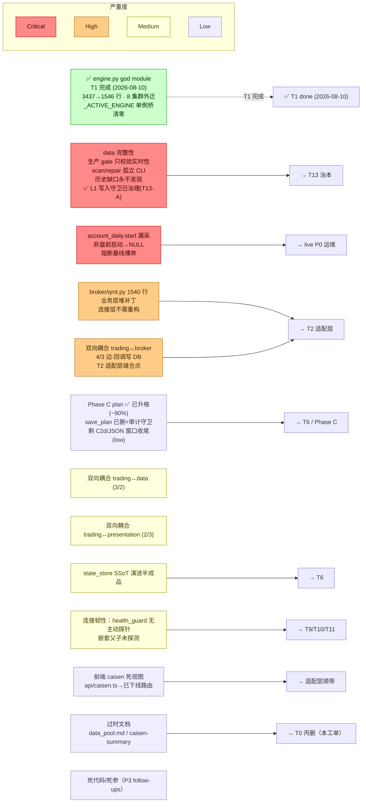

> 最近复核：2026-08-11 · 维护者：wayfinder-session ·
> 权威归宿：**技术债 / 痛点 / god module 判定**（单一归宿）。模块结构（不判债）见 [#2](02-module-dependencies.md)；本视图是 #2 的「债务切片」——只画债-bearing 项 + 严重度，不重复依赖边。

# #6 技术债 / 已知缺口分布

路线图即技术债热力图。严重度四级（Critical / High / Medium / Low），每项链对应 wayfinder 工单（→ 治理归宿）。

## 债务热力图

## 债务清单（按严重度）

### Critical（阻塞 live / 阻塞演进主脊柱）

| 项 | 物理事实 | 治理归宿 |
|---|---|---|
| ✅ **engine.py god module —— T1 完成（2026-08-10）** | **已治理**：3437→1546 行（-55%），10 集群外迁 8 个（A critical / B data_ctx / D eod_plan / E-F-G-H phases×4 / I order_state），`_ACTIVE_ENGINE` 单例桥代码清零（仅注释/docstring 引用历史），engine 仅留调度/装配/gate/job wrapper + re-export 兼容块。终验：trading 515 单测 + e2e 长周期 26 测全绿（行为等价）。历史态内部结构 → [deep-dives/engine-current-state](deep-dives/engine-current-state.md) | ✅ [T1 done](../../plans/wayfinder/T1.md) |
| **data 完整性 gate 缺陷** | 生产 gate 只校验实时性不校验历史连续性；`scan_integrity`/`repair_gaps` 孤立 CLI 无调度；历史缺口被动跳过永不发现（[T5](../../plans/wayfinder/T5.md)）。**L1 写入守卫 + daily 双轨收口 + freshness 行数骤降已治理（T13-A · 2026-08-11，已合并 master）；L1 覆盖面 deferred：`sync_data_lake.py:158/181` + `sync_macro_credit.py:212` 三处非 daily 写入口仍裸 `to_parquet` 未接入守卫（非 T12 主路径，docstring 已声明 deferred）；**L2 scan gate + L3 自动补采已治理（T13-B · 2026-08-11 合并 `31304e9f`）：scan gate 接 `pipeline_then_eod:155` + 每周全扫 `engine.sched` cron + scan→repair 异步闭环（配额 50/熔断 sidecar/限频 `_fetch_paged`/超时 1800s）；降级 scan FAIL 不阻断 eod（blueprint §2.3，DG-7 用户确认不推翻）**；剩收尾（W0）：① T13-A P1 shibor/macro 窗口写误伤（守卫语义设计，deferred）② filter_universe_by_continuity 接告警通道（设计：caller 告警 vs filter 内告警，deferred）③ 3 处裸写接 write guard（与 P1 守卫语义耦合，deferred）** | [T13](../../plans/wayfinder/T13.md) |
| **account_daily.start 漏采** | 模拟盘/非盘前启动 → `start_total_asset` NULL → C-1 熔断 -3% 基线裸奔 | live P0 运维（pre_open 窗口内必须起） |

### High（演进主脊柱缝合点）

| 项 | 物理事实 | 治理归宿 |
|---|---|---|
| **broker/qmt.py 业务层堆补丁（1540 行）** | 连接层不需重构（[T4](../../plans/wayfinder/T4.md) 裁定）；债在业务层（串通挂撤/拒涨停/撤单延迟的处理逻辑） | [T2](../../plans/wayfinder/T2.md) |
| **双向耦合 trading↔broker（4/3）** | engine 调 broker 下单，broker 回调 engine 写 trade_event/state_store —— T2 适配层契约核心切点 | [T2](../../plans/wayfinder/T2.md) |
| ~~**Phase C plan 未升格**~~ → **✅ 降级 Low（Phase C 已完成 ~90%）** | `save_plan`/`confirm_plan` **已删**（`trading_plan.py:132-137`）+ `audit_ssot.py:79-84` BANNED 守卫；生产写入已切 DB（`eod_plan.py:202-229` 写 SIGNAL/CONFIRMED）；`load_plan` DB 优先 + JSON 只读回退。**剩收尾（W0 deferred）**：① C2d `experiment/cli.py:53 _load_all_plans` 仍扫 plan_*.json（代码自标 follow-up，需重设计三选一，推荐 option 3 experiment.db 镜像，耦合 W1-A eod_plan hook）② JSON 回退窗口关闭（待「发布周期」过 + 生产 JSON 清理）③ `_resolve_account_id` 四处复制 → `trading/account.py`（**并入 W1-A**）| [T6](../../plans/wayfinder/T6.md) / Phase C |

### Medium（横向治理）

| 项 | 治理归宿 |
|---|---|
| 双向耦合 trading↔data (实跑 4/2)、trading↔presentation (实跑 5/3) —— T1 engine 拆分时理顺。**data.integrity→trading.calendar 真函数级循环已切断（M1 · 2026-08-12，`fetch_trade_cal` 下沉 `data/calendar.py`，data 层零 trading 静态依赖）**；trading→presentation 的 8 处 lazy import 全指 `trading_service.py`（位置错配，下沉归 W1-A T2 地基）| [T1](../../plans/wayfinder/T1.md) |
| state_store SSoT 演进半成品（Phase B+C 收口后剩余） | [T6](../../plans/wayfinder/T6.md) |
| 连接韧性：health_guard 无主动探针 watchdog / 嵌套父子进程未探测 | [T9](../../plans/wayfinder/T9.md) / [T10](../../plans/wayfinder/T10.md) / [T11](../../plans/wayfinder/T11.md) |
| **【测试卫生】✅ 已治理（M4 · 2026-08-12）**：真污染源 = 测试**裸写 breaker 内部状态**（`_state`/`_failure_count`）无 finally 还原（非「替换模块属性」，原排查方向落空）。治理：① `CircuitBreaker`/`RateLimiter` 加 `reset()` ② 根 conftest 加 autouse `_reset_resilience_singletons`（每用例前 reset 全部单例，治本）③ 清 4 处裸写（删冗余入口 reset + 刻意 OPEN 改 monkeypatch）④ 删 `_DEFAULT_DB_OVERRIDE` 死代码。全量 1687 绿，canary `test_resilience_singletons_start_clean` 守门 | ✅ [M4 done](../../docs/superpowers/plans/2026-08-11-m4-test-hygiene.md) |

### Low（清理类）

| 项 | 治理归宿 |
|---|---|
| 前端 caisen 死视图（`presentation/web/src/api/caisen.ts` → 已下线后端路由，首页 `/caisen` 空态） | T2 适配层顺带 / 独立清理 |
| 过时文档 `data_pool.md` / `caisen-methodology-summary.md` | **本工单 T0 丙删** |
| 死代码 / 死参数（P3 follow-ups：消息重复 / pro 死参等） | 各源工单 follow-up |
| **【测试流程】风控闸变更未同步测试**：T1 删 confirm/allow_live 闸时 `test_submit_order_no_confirm` 未同步删（2026-08-11 已删）+ 时间依赖测试 `test_low_power_discovery`（已 mock 时间窗口修）。过时测试积累成「既有红」掩盖真回归（曾阻塞 T13-A 合并判断）。范畴已排查仅此一例（`_allow_live` 无其它遗留） | CI 全量绿门 + 行为变更时 grep 测试同步 |

## 非痛点（明确不在债内 — MAP Out of scope）

- `broadcast` / `config` / `discovery` / `experiment` / `ops` / `compute_unit`：非痛点模块，仅当三维扩展（[T3](../../plans/wayfinder/T3.md)）要求时由适配层工单驱动改造。
- 颈线法策略算法本身（缺口在 [neckline-algorithm-gaps] memory 独立跟踪，非架构债）。
