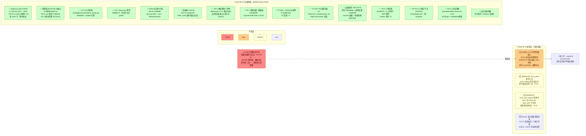

> 最近复核：2026-08-15 · 维护者：debt-full-wave session ·
> 权威归宿：**技术债 / 痛点 / god module 判定**（单一归宿）。模块结构（不判债）见 [#2](02-module-dependencies.md)；本视图是 #2 的「债务切片」——只画债-bearing 项 + 严重度，不重复依赖边。
> **波次记录**：`debt/full-wave-0815`（T1-T18 · 2026-08-15）——对 2026-08-14 批判性复核（[deep-dives](deep-dives/2026-08-14-critical-review.md)）登记的 CR-1..11 全量清偿 + W1-B/W2/TD/SS/CN 遗留收口；本文件即该波次销账终态对账单。清偿后记见 [deep-dives 文头「2026-08-15 清偿后记」](deep-dives/2026-08-14-critical-review.md)。

# #6 技术债 / 已知缺口分布

路线图即技术债热力图。严重度四级（Critical / High / Medium / Low），每项链对应 wayfinder 工单（→ 治理归宿）。

## 债务热力图（2026-08-15 销账终态）

## 债务清单（按严重度 · 销账终态）

### Critical（阻塞 live / 阻塞演进主脊柱）

| 项 | 物理事实 | 治理归宿 |
|---|---|---|
| ✅ **engine.py god module —— T1 + W1-B 全收口** | T1（2026-08-10）：3437→1546 行，8 集群外迁，`_ACTIVE_ENGINE` 单例桥清零。**W1-B/T10（`e2a6153f` · 2026-08-15）**：engine re-export 兼容块整体删除（1693→1469 行）+ gateway lazy 顶部化（模块对象风格）；7 处外部引用迁物理真身、~120 测试触点迁移；现 engine.py **1481 行**，纯调度/装配/gate/job wrapper，**零符号中转站**（grep `^from trading.` 仅 15 行自用直 import）。行为等价：T10 全量 1908+2 存量红（基线同款）、T15 L4 双跑零 diff | ✅ done（[T1](../../plans/wayfinder/T1.md) + W1-B） |
| ⚠️ **data 完整性（运行态尾巴——代码路径全治，数据侧余真值缺口）** | 代码侧全治理：T13-A/B + D1（08-11/12）写入守卫/scan gate/异步补采；**CR-6/T6（`4b636756`+`3abea439` · 2026-08-15）回路复活**——单日异常部分落盘（不再整轮丢弃白拉）+ daily/adj 原子入列（防 NaN 落湖）+ `REPAIR_DAY_SLEEP` 限频降速；**实弹 350/350 日零中断、熔断 sidecar 复位、湖 byte-identical 零漂移**。⚠️ 残留：补成 0 段——配额被长停牌真缺占据（→ 下条【High】新债）。15701 段（复核口径）含真停牌洞 | ⚠️ 真值缺口 → 新工单（见 High 新登记） |
| ✅ **【CR-1】discovery 研究首页死页面** | `5d999375`（T1 · 2026-08-15）：`discovery.ts` 四函数剥壳语义直返 + **形状契约静态守卫 `check_no_double_unwrap` 入 gate②**（单行正则、读不到 fail-closed）；vitest 13 文件 33 测全绿 + vue-tsc 0 错；顺手修 predev 死路径（`scripts/ops/check_ports.py`→`ops/`）。守卫局限（多行解构不命中）已知成文 | ✅ done（T1） |
| ✅ **【CR-2】入场价位三件套双份实现** | `fbbeb82a`（T7 · 2026-08-15）：单源真身 `strategies/neckline/price_levels.py`（`PriceLevels` + `compute_price_levels` + `PRICE_LEVEL_DEFAULTS`）——brief 原址 trading/compute/ 违分层铁律（strategies 禁 import trading），改址仓内先例同向（ExitAction 同款）。backtest.py/plan.py/两 diag 副本全收编；C1 兜底 2.0→1.0（实证 2.0 幽灵默认从未生产生效，零行为变化）；11 golden 测试钉死 + backtest/plan 行为级等价。残留：`method_v0.py:328/337` 识别层 rr 门控副本（语义不同，未收编——见 Low 清单）| ✅ done（T7） |
| ✅ **account_daily.start 漏采 → 全链 fail-closed** | G3 `8d4ef714`（08-13）：基线缺失 live `raise _CriticalHalt` 停调度 + pre_open T-1 兜底回填。**CR-4/T2（`7296e3f3`）补对称缺口**：curr_equity 缺失/异常 live 推 CRITICAL + `_CriticalHalt`（原 fail-open 静默 skip）+ 收盘快照失败 live 有声（掏空次日基线链的静默面收口）。测试 `test_breaker_fail_closed.py` 9 测钉死（live halt ×3 + dry skip ×2 + 快照告警）| ✅ done（G3 + T2） |

### High（演进主脊柱缝合点）

| 项 | 物理事实 | 治理归宿 |
|---|---|---|
| 🆕 **【2026-08-15 新登记】scan 停牌真值缺口（T6 实弹暴露 · T16 素材）** | `scan_integrity` 报 16371 段 unjustified（418 标的），但其中含**长停牌真缺**：本地 `suspend_d.parquet` ground-truth 不覆盖历史长停牌区间 → `suspend_justified=False` 误判 → 每轮 50 段补采配额被「永不可补」的段占据 → 补成 0 段、记 success、下轮重试同 50 段 → **永不净收敛**。铁证：`000029.SZ`（深深房A）湖内洞 2016-09-14~2020-11-06（1514 天）与其恒大重组停牌四年公开事实完全吻合；首批 50 段 36 标的洞高度集中于 2016-2018 A 股停牌潮年代（000006.SZ 177 天洞等）。注意 Tushare `suspend_d` **不覆盖历史长停牌**，需另寻真值源（全历史回补或「该日全市场有数据而此标的无」启发式）+ repair 侧 unfillable 标记防死占 | **→ 新工单（data 完整性线）**（素材：task-6/16-report） |
| ✅ **broker/qmt.py 业务层堆补丁 —— W2-H1 四文件分层** | `e3195df0`（T13 · 2026-08-15）：`qmt.py` 1692→**132 行**（类组装 + 显式列名 re-export），拆 `qmt_connection.py` 1025（契约根/常量/12 辅助/8 回调/连接）、`qmt_io.py` 334（6 IO 方法）、`qmt_business.py` 479（15 业务方法）；新增 `trading/broker_ports.py` **`BrokerProtocol`**（runtime_checkable 最小契约面 + Mock 负面钉子）。**AST 级 53/53 函数体逐字一致**（逻辑只搬）；常量值零漂移（logger 名锁定 `broker.qmt`）；全量 1933 passed 基线同款 | ✅ done（W2-H1 · T13） |
| ✅ **双向耦合 trading↔broker —— W2-H2 回调 Ports 化** | `7be0419f`（T12 · 2026-08-15）：`handle_order_update(engine,...)` → `handle_order_update(ports,...)`，16 处 `_state_store` 副作用 + 3 处 `engine._gw` 经 `EnginePorts.state_store/gateway` 显式注入；engine 侧薄 wrapper 调用时快照。08-04 幂等红线载体逐行保形。#2 复跑边权 6/6（四文件分层后记账面变化，见 #2 漂移注记）。T13 裁定 `ports.gateway` 保留（回调体查**实例态** `_orders/_seq_to_real`，模块分层替代不了实例锚点） | ✅ done（W2-H2 · T12） |
| ✅ **【CR-3】「日内熔断」实为盘后闸** | `0072e1a1`（T8 · 2026-08-15）：评估点前移——`PortfolioBreakerThrottle`（5min 节流，经 ports 注入）挂进 stop_loss 30s 巡检（⑤撤单后）；三分支：触发→先撤后 `emergency_halt`（**不停调度保监控存活**）/评估失败 streak≥3 才告警/基线缺失→breaker fail-closed SSoT（live 转 emergency_halt 不停调度）。post_close 盘后闸仍完整在岗兜底。5 新测 + tests/trading 615 全绿。⚠️ 语义边界（已入 guardrails §六）：lock_down 后 `_gw_health_gate` 每轮 skip monitor（既有引擎行为）——「保监控存活」实为调度器存活 + health_guard 在岗可人工解锁；盘中无 T-1 兜底→盘后启动首轮假阳性 halt（follow-up 见 Low 清单） | ✅ done（T8 · 语义边界成文） |
| ✅ **【CR-5】「防超卖 > 防漏挂」三层同向盲区** | `6d434ce4`（T3 · 2026-08-15）三件套：① audit 反向扫描（fill 净额≠0 而 position 缺行/为 0 → 漏挂向告警）；② 孤儿口径单源常量（删从未写入的 OPEN，补生产实写集）；③ `fill.direction` CHECK（DDL 两处 + G5 备份回灌迁移带 account_id/strategy 保数据 + `insert_fill` 入口 ValueError 先于 DB CHECK 防误吞）。**T17 补全（T3 遗留）**：孤儿集合再补 DRY_RUN/BLOCKED/REJECTED/DIRECTION_UNKNOWN 四个下单审计实写 action + :91 注释订正（SUBMITTED 实写 order 表）+ 巡检连接 `mode=ro`。风险取向已显式写进 [guardrails §六](../guardrails.md)（T5） | ✅ done（T3 + T17 补全） |
| ✅ **【CR-4】curr_equity 缺失静默跳过** | 见 Critical 表末行（`7296e3f3` · T2）——原 High 条目随对称收口升级销账 | ✅ done（T2） |

### Medium（横向治理）

| 项 | 物理事实 | 治理归宿 |
|---|---|---|
| ✅ **双向耦合 trading↔data（TD）—— 边清零** | `ddb9c9a9`（T9 · 2026-08-15）：检查点入口本质是 ops 编排件 → `data/tools/run_data_check.py` 迁 `ops/`（9 文件 +117/−71，bat/tests/docs 引用全量更新，schtasks 元数据实证无需改）；`expected_latest_trade_day` 下沉 `data/calendar.py` + trading 侧 re-export 兼容。**#2 复跑 `data→trading = 0`**（基线 1）——依赖图最后一条 data→trading 反向边清零 | ✅ done（T9） |
| ✅ **state_store SSoT 演进（SS）—— 四决策定稿** | [T6 工单 closed](../../plans/wayfinder/T6.md)（T16 · 2026-08-15）：① plan→SQLite 不重启（DG-5 划线）② 多策略/多账户隔离=W3 划线 ③ 表扩展=Phase A/B/C 已治 + fill.direction CHECK（T3）④ 读写键对齐=`is_vetoed` 单点（T11 `710d9c30`）+ **actual_sid DB 单源**（M2/T14 `ccaad5c9`：`get_session_id/set_session_id` 列级写口，修 L3 upsert clobber + B2 轮换双写欠账）+ `StopLossContext`（T11） | ✅ done（T6/T11/T14/T16） |
| ✅ **连接韧性（CN）—— T9/T10/T11 全闭** | T9 探针 `299ab2de`（`probe_account_status` 线程池+超时 + health_guard 集成）；**T10 实证关闭**（`710d9c30`）：实测发现真嵌套为 venv launcher 单树形态（1456→11548→spawn worker）→ 补 `_drop_engine_descendants` 递归祖先链去重（孙辈经非匹配中间进程挂下不漏杀）+ 7 用例；**T11** connect rc=-1 每轮 `logger.warning` 留痕（观测补齐零行为变更，G8 重试形态保持）。T10/T11 工单 Resolution 均已闭合 | ✅ done（bf55c6ae 收尾） |
| ✅ **【CR-7】audit_ssot 巡检无人调度 + 告警单通道** | `42e3bd96`（T4 · 2026-08-15）：① `LocalFileChannel` 本地第二通道（append `logs/alerts.log`、永不抛、无条件装配、`__file__` 锚定项目根）② `register_audit()` schtasks **QuanterAudit DAILY 16:05**（已注册实证 Ready；16:05=post_close 后避开 17:00 管道）③ `ops/run_audit.bat`（T17 补 `if not exist logs mkdir logs` 守卫）。清退红线测试锁定（误入 RETIRED/LEGACY 会删成静默裸奔）。smoke 暴露 2 项存量 FAIL（account_daily 闭合 11 条 + 端口无 pid 文件）→ 属实存量，T16 已清 ACC debris / 端口项属运维侧旧链 | ✅ done（T4） |
| ✅ **【CR-8】前端观测面断链族** | T16 `e6100a79` + T17 收官：② `/macro/sector/flow` **已删**（sector 湖 2026-07-27 退役恒空；端点收缩 `/macro/pool` + 前端板块图块删 + 404 防复活钉；顺手修 pool 形状错位 `string[]`→`{symbol}[]`）；③ 孤儿路由显式处置——**training×5 保留**（隐藏消费方 `infra/tools/dingtalk_review_bridge.py` 常驻桥消费 `/training/review`）、**research proposals×5 保留**（同桥 `/research/proposals/review`，:13 注释失准已由 T17 订正）、`/ops/processes` 保留（B2-3 内部观测端点）、`/review/diagnose` 保留（CLI 写面，人工 curl 直调）；① `POST /auth/read-cookie` 前端接入（TerminalLogs SSE 配 token）**未做**——G2 修了后端半截，前端半截悬空，live 配 token 时日志面板将静默 401，**唯一 CR-8 残留**（登记 Low 清单待领） | ✅ done + 1 残留（T16/T17） |
| ✅ **【CR-9】三套工单体系状态失同步** | `e6100a79`（T16 · 2026-08-15）：wayfinder 8 工单回填（T0.1/T2/T13/T9/T6/T7/T8 闭 + T10/T11 核对已闭）；MAP.md frontier 重写——**剩余 frontier = T3 唯一余项**（W2 主体已落阻塞解除）；Decisions 回填 8 条；sdd G7 补账（progress 条目 + 事后补记报告，复跑 21 绿）+ G8 撞号消歧注。波次收尾三件套（刷 #2/#6/回填工单）即本 T17 | ✅ done（T16/T17） |
| ✅ **【CR-10】CI 曾静默死亡 19 天且无元守卫** | `6f70faa6`（T5 · 2026-08-15）：新建 `.github/workflows/ci-heartbeat.yml`（每日 schedule 断言最近 run ≤7 天，独立 concurrency + 最小权限）+ ci.yml 加周一 schedule 心跳。平台边界成文（GitHub 60 天无活动自动停 schedule）；心跳基线依赖 master 首次成功 run（T18 push 后建立） | ✅ done（T5 · 基线待 T18） |
| ✅ **【测试卫生】（M4 · 08-12）+ silently orphaned patch 审计（T17）** | M4 已治理（resilience 单例 reset + autouse fixture + canary）。**T17 审计（本波次）**：临时脚本扫 tests/ 全部 `patch("trading.engine.X")`/`setattr(engine,"X")`——活代码命中 27 符号（字符串 16 + 对象 11）**全部仍是 engine 模块属性，孤儿 = 0**；仅 3 处正则命中位于历史迁移叙述注释内（`_last_quote_blackout_alert_ts`/`trading_plan`/`decide_exit`，均为 W1-A/W1-B 迁移记录，如实保留）。test_pre_open_ledger_semantics 死 import 复核零残留（T11 已清）。审计报告贴波次 commit body | ✅ done（M4 + T17 审计） |

### Low（清理类）

| 项 | 物理事实 | 治理归宿 |
|---|---|---|
| 🆕 **【Medium 严重度 · 2026-08-15】entry_date 取写入日而非成交日** | `apply_fill_to_position` 的 entry_date 取 `clock.today()`（`state_store.py:1047/1064`）而非成交日 traded_time——「跨午夜盘后写入」边界会让建仓日漂一天。T15 测试侧冻结规避（clock freeze 2026-07-02），产品侧是否改解析 traded_time 属**独立议题未动**（超测试修复授权）。holding_days/持仓周期归因消费此字段 | 待领（独立议题） |
| 🆕 **【Medium 严重度 · 2026-08-15】save_plan_legacy JSON 死种子** | DG-5（`11616220`）后生产 `load_plan` 只读 DB trade_event(SIGNAL).meta——`save_plan_legacy`（tests/_legacy_plan_io.py shim）写的 JSON 种子对 `load_plan` 恒不可见。T15 已修 probabilistic_broker 两例（DB 种子同构 C2c）；**其它仍用它的历史测试若断言经 `load_plan` 读回将同类红**（本波次 L3 范围内无此类，属潜在项） | 待领（测试卫生） |
| 🆕 **波次遗留清理清单（debt/full-wave-0815 ledger 转录）** | ① **T13-C 未竟维度**：D5/D6/D7/D9 未按原编号整体落地（部分语义散落 T13-A/增量脚本，T13 工单已诚实注记不虚销）——建议与停牌真值工单同批；② `engine._submit` 零内部调用者（W1-B 后遗留）；③ `_ORDER_TIMEOUT` 一全局三拷贝（qmt_connection/io/business from-import 副本，运行期调超时踩三处）；④ seeding 同构第三份拷贝宜抽共享 helper（T15）；⑤ `_is_trading_day` 与 `trading.calendar.is_trading_day` 一行镜像双份（T9 刻意、注释互引）；⑥ `method_v0.py:328/337` 识别层 rr 门控价位副本（语义不同未收编，T7 记录）；⑦ `strategies/neckline/price_levels.py` 不在 `compute_unit/hashes.py` ENGINE_FILES（指纹未罩住新真身，T18 决策）；⑧ T7/T8 ADR「待用户终签」手续债（决策内容已被两波次实跑约束）；⑨ CR-8 残留：TerminalLogs SSE 接 read-cookie（live 配 token 静默 401）；⑩ 盘中熔断同享 T-1 兜底（T8 follow-up，防盘后启动首轮假阳性 halt）；⑪ `manage_ops_schtasks._schtasks` 在 PYTHONUTF8=1 下 GBK 解码炸 reader 线程（注册成功但 stdout 丢）；⑫ 仓库孤儿 stash `!!GitHub_Desktop<master>` 择日人工清点（T12 事故记录）；⑬ DC 死代码线索（消息重复/pro 死参）**线索穷尽未复现**（T17 grep：消息重复仅 notifier 幂等守卫与 broadcast 去重设计；「死参」命中全为 min_rr P4 复活史述；vitest.config/.env.example 注释 T1/T5 已修） | 各源工单 follow-up |
| ✅ **过时文档 data_pool.md / caisen-methodology-summary.md** | 丙删早已执行（Phase 0 收尾，CR-9 复核确认） | ✅ done |
| ✅ **【CR-11】文档漂移族** | `6f70faa6`+`bc69d546`（T5 · 2026-08-15）：guardrails.md 刷新（测试数 1892 截至标注 + 路径全订正 + §四 E2E 重写 + 新增 §六 fail-closed 语义与**风险取向显式声明**）；data-source-of-truth.md 刷新（7 项巡检实况 + QuanterAudit 调度 + Phase C 语义订正，评审修复清退红线方向写反）；`.env.example` 路径订正。#1/#3/#7/#8 已于 08-14 订正 | ✅ done（T5） |
| ✅ **【测试流程】风控闸变更未同步测试** | 已收口（T1 期清 + 时间依赖测试 mock；T15 存量红真因钉死=save_plan_legacy 死种子而非日期敏感——诊断偏了一层的实证）。**全量红 = 0**（T15 后 1943 passed + 0 failed） | ✅ done（T15） |

## 销账对照速查（波次 T1-T17 → CR/遗留项）

| CR/遗留 | 处置 | 落地 commit |
|---|---|---|
| CR-1 discovery 死页 | ✅ 直返化 + 形状守卫入 gate② | `5d999375`（T1） |
| CR-2 价位双份 | ✅ price_levels.py 单源 + golden | `fbbeb82a`（T7） |
| CR-3 盘后闸 | ✅ 评估点前移 5min 节流 | `0072e1a1`（T8） |
| CR-4 curr_equity fail-open | ✅ live fail-closed + 快照有声 | `7296e3f3`（T2） |
| CR-5 防超卖>防漏挂 | ✅ 反向扫描+口径+CHECK（+T17 集合补全/ro 连接） | `6d434ce4`（T3）+ 本 T17 |
| CR-6 补采回路 | ✅ 部分落盘+原子入列+限频（实弹 350/350） | `4b636756`+`3abea439`（T6） |
| CR-7 巡检无调度/单通道 | ✅ QuanterAudit 16:05 + LocalFileChannel | `42e3bd96`（T4） |
| CR-8 观测面断链 | ✅ sector 删+孤儿路由显式处置（残留 read-cookie 前端接入登记） | `e6100a79`（T16）+ T17 注释订正 |
| CR-9 工单失同步 | ✅ 8 工单回填 + MAP 重写 | `e6100a79`（T16） |
| CR-10 CI 无元守卫 | ✅ ci-heartbeat + 周一 schedule | `6f70faa6`（T5） |
| CR-11 文档漂移 | ✅ guardrails/data-source-of-truth/.env.example | `6f70faa6`+`bc69d546`（T5） |
| TD data→trading | ✅ 边清零（#2 复跑 = 0） | `ddb9c9a9`（T9） |
| W1-B re-export | ✅ 块删除 + gateway 顶部化 | `e2a6153f`（T10） |
| CN T9/T10/T11 | ✅ 探针 + 嵌套去重 + connect 留痕 | `299ab2de` / `710d9c30` / `bf55c6ae` |
| Q/TB（W2-H1/H2） | ✅ broker 四文件 + 回调 Ports | `e3195df0` / `7be0419f`（T13/T12） |
| M2 读写键 | ✅ actual_sid 单源 + is_vetoed + StopLossContext | `ccaad5c9`（T14）/ `710d9c30`（T11） |
| SS（T6 工单） | ✅ 四决策定稿 + 落地 | T16 回填 + T3/T11/T14 |
| 测试存量红 | ✅ 真因钉死（死种子），全量红=0 | `a4e5cc40`（T15） |
| 波次门 L3/L4/perf | ✅ 26 绿 / 双跑零 diff / +1.9%≪10% | T15（无独立 commit，报告实录） |

## 非痛点（明确不在债内 — MAP Out of scope）

- `broadcast` / `config` / `discovery` / `experiment` / `ops` / `compute_unit`：非痛点模块，仅当三维扩展（[T3](../../plans/wayfinder/T3.md)）要求时由适配层工单驱动改造。
- 颈线法策略算法本身（缺口在 [neckline-algorithm-gaps] memory 独立跟踪，非架构债）。**边界澄清**：CR-2 已收口「同一算法两份实现」的工程 SSoT 债；算法有效性问题（regime/期望/Kelly）属 A 波——**仍是当前最高优先空洞**（[roadmap 里程碑](roadmap.md)）。
