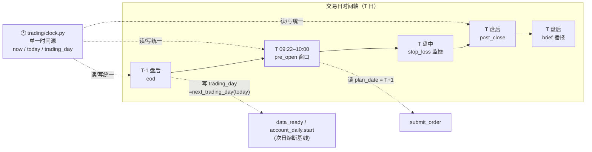

> 最近复核：2026-08-08 · 维护者：wayfinder-session ·
> 权威归宿：**job 时间窗 / 时钟语义**（单一归宿）。进程/调度结构见 [#4](04-process-topology.md)；时钟统一改造细节见 memory C6。

# #8 控制 / 时间流

quanter 的时间模型：单一时钟源（C6 `trading/clock.py`）+ 各 job 的时间窗 + 读写口径命名区分（防 T+1 错位）。本视图是 [#4](04-process-topology.md) 拓扑的「时间切片」——只画带时间语义的 job，不重复拓扑结构。

## 交易日时间轴 + 时钟源

## 时间语义表

| job | 时段 | 读口径 | 写口径 | 关键不变量 |
|---|---|---|---|---|
| `eod` | T-1 盘后 | `today` | `trading_day = next_trading_day(today)` | 写次日 `account_daily.start` + `data_ready`（为 T 日 pre_open 备基线） |
| `pre_open` | T `[09:22, 10:00)`（env 可调） | `plan_date = trading_day`（=T+1 写入值） | trade_event(SIGNAL)/plan | **窗口过只补数据 + CRITICAL**（不补挂单） |
| `stop_loss` | T 盘中 | `today` | position.current_stop / trade_event | 盘中监控，L2 单只拒单 |
| `post_close` | T 盘后（收盘后） | `today` | position + account_daily.close | 日终闭合（fill 累加↔position，account_daily start+close 非空） |
| `brief` | T 盘后 | `today` | job_ledger brief_<bot> | 播报幂等（第 8 域） |
| `data_pipeline`（schtasks） | 定时 daily | — | data_lake parquet | 独立进程（[T15](../../plans/wayfinder/T15.md) env 合成） |
| `discovery`（schtasks） | 02:00 daily | — | experiments.db | DETACHED daemon |

## 时钟统一（C6）—— 防漂移陷阱

- **单一时间源** `trading/clock.py`：`now()` / `today()` / `trading_day`（读/写口径命名区分）。全包 `datetime.now()` 收口于此（grep 仅 clock.py 有直接 `datetime.now`）。
- **入口缓存防漂移**：`_eod` 用 `_today`/`_td` 读/写分流；`pre_open` 内部用传入 `date` 参数，不直接读 clock。
- **T+1 错位修复（memory）**：旧 `_eod` 用 `today` 落盘 → pre_open 次日读 T+1 永远差一天 → 永不挂单。修复后 eod 写 `next_trading_day`、pre_open 读 `plan_date` 对齐。
- **测试单口子**：`monkeypatch trading.clock`（C6 收口后唯一注入点）。

## 时区（C9 / T6 配套）

- 全程 `Asia/Shanghai`（前端 `toLocalDateStr` + vitest TZ；C9 T6 收口）。
- `trade_cal` / 日历读取统一走 Tushare 交易日历（C-9 T0-fix sys.path 解阻后）。

## 已知时间相关风险（详见 [#6](06-tech-debt.md)）

- **`account_daily.start` 漏采**：非盘前启动 → start NULL → 熔断基线裸奔（pre_open 窗口内必须起来）。
- **lifespan 补跑时序**：启动补跑读 `job_ledger` 判四态，窗口过不补挂单（C8）。
