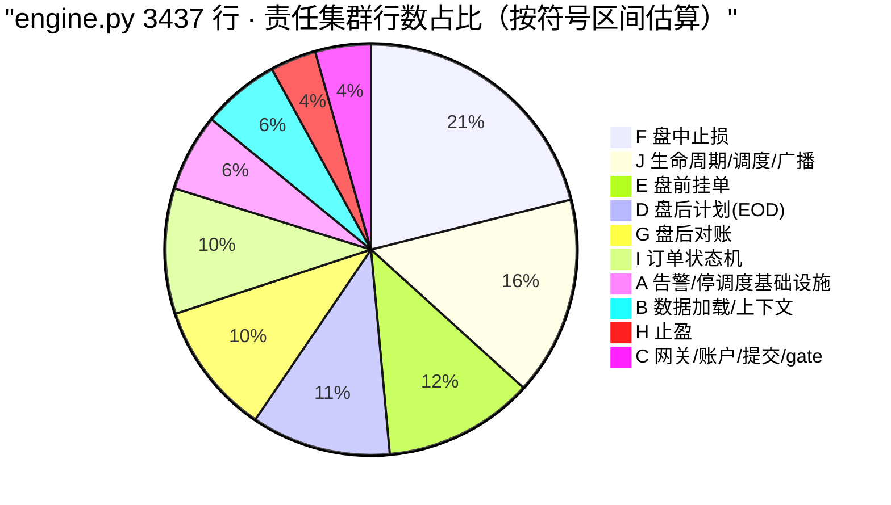
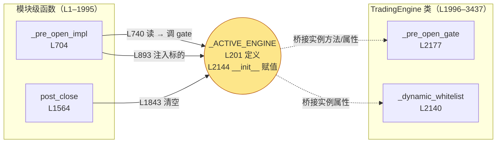
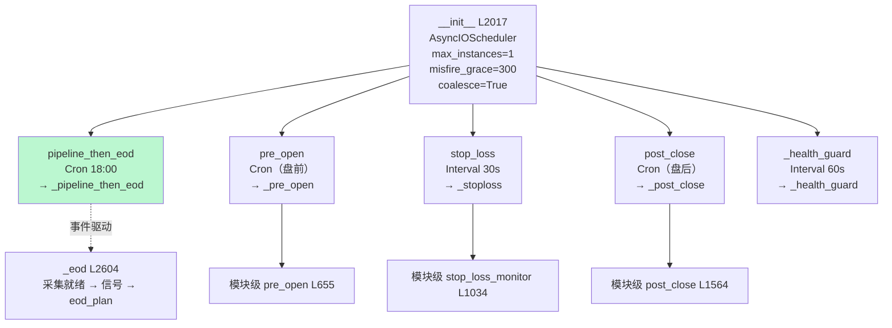
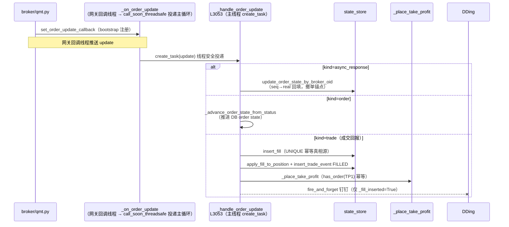
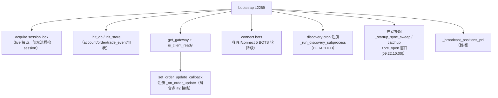
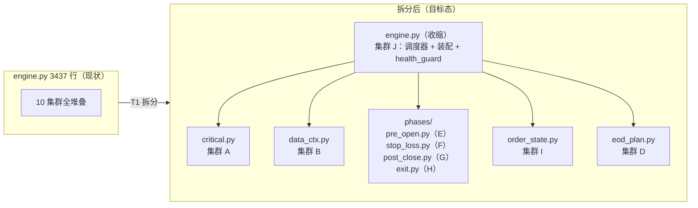

> 最近复核：2026-08-09 · 维护者：wayfinder-session ·
> 权威归宿：**`trading/engine.py` 内部结构**（[T0.1](../../../plans/wayfinder/T0.1.md) 产出，毕业自 [T0](../../../plans/wayfinder/T0.md)）。
> 活文档——随 engine 代码演进，改 engine 时同改本文件 + 刷「最近复核」。**行号截至复核日**，代码变更后行号漂移以符号名为准。
> 单一归宿——他视图（[#2](../02-module-dependencies.md) 模块依赖 / [#5](../05-state-machines.md) 状态机 / [#6](../06-tech-debt.md) 技术债）引用 engine 内部结构时**链此不重抄**。

# `engine.py` 当前态深剖（T0.1）

[T0.1](../../../plans/wayfinder/T0.1.md) 的产出：把 god module `trading/engine.py`（3437 行）解构成 **责任集群 + 调用图 + 拆分缝合点**，为 [T1](../../../plans/wayfinder/T1.md)（engine 模块化拆分）提供目标态地基。本文件是 engine 内部结构的**唯一权威**。

## 0. 摘要：为什么 `engine.py` 是 god module

| 维度 | 数值 | 含义 |
|---|---|---|
| 总行数 | **3437** | 单文件认知超载（trading 包 10620 行，engine 占 32%） |
| 顶层符号 | **42**（22 模块级函数 + 1 异常类 + 1 类含 20 方法） | 职责堆叠 |
| 责任集群 | **10** | 一个交易日的全部物理动作 + 进程生命周期全塞一处 |
| 耦合形态 | 模块级函数 ↔ 类方法 **双向交织** | 经 `_ACTIVE_ENGINE` 单例桥（5 处使用），边界模糊 |
| 依赖注入 | **混合**（模块级全局为主 + 少量实例属性） | 非 DI，`state_store`/`lake`/`bots` 全是模块全局 |

**god module 的本质**：engine.py 把「一个交易日的全部物理动作」（数据加载 → 信号 → 计划 → 挂单 → 止损 → 止盈 → 对账 → 成交回报）与「进程生命周期」（bootstrap / scheduler / health_guard / broadcast）合并进一个文件，且模块级函数（`pre_open` / `stop_loss_monitor` / `post_close`）与类方法（`_pre_open` / `_stoploss` / `_post_close`）职责镜像、经单例桥互调，致使任一职责的修改都在同一文件内散弹。

## 1. 物理结构（符号 TOC + 行数分布）

### 1.1 符号清单（行号截至 2026-08-09）

**模块级（L1–1995）** —— 22 个顶层函数 + 1 异常类，承载「一日内四阶段 + 基础设施 + 数据加载」：

| 行号 | 符号 | 集群 | 职责 |
|---|---|---|---|
| 112 | `_alert_critical(msg)` | A | CRITICAL 钉钉告警统一收口 |
| 141 | `class _CriticalHalt(Exception)` | A | L1 致命停调度异常 |
| 155 | `_critical_guard(coro_method)` | A | 装饰器：job 入口捕获 `_CriticalHalt` → `_halt` |
| 208 | `_mode()` | A | `dry_run`/`live` 模式读口 |
| 217 | `_trade_cfg()` | A | 交易配置读口 |
| 273 | `_load_universe(lake)` | B | 加载标的宇宙 |
| 295 | `_load_df_upto(lake, symbol, date)` | B | 加载日线至某日 |
| 328 | `_load_recent_plan_symbols(days_back, today)` | B | 近期计划标的集合 |
| 376 | `_resolve_cooldown_days(experiments)` | B | 冷却期解析 |
| 401 | `_load_integrity_ctx(today)` | B | 数据完整性上下文 |
| 437 | `_resolve_id_window(strategy)` | B | 信号识别窗口 |
| 454 | `_resolve_account_id()` | C | 账户 ID 解析 |
| 466 | `get_gateway()` | C | 交易网关单例读口 |
| 477 | `async _submit(order)` | C | 挂单提交薄包裹 |
| 498 | `async eod_plan(date, signals, atr_map, capital)` | D | **盘后计划生成**（颈线法信号 → 计划参数 + trade_event SIGNAL/CONFIRMED） |
| 655 | `async pre_open(date)` | E | **盘前入口**（job_ledger 台账包裹） |
| 704 | `async _pre_open_impl(date)` | E | 盘前实现（确认闸 → 撤昨日 → 熔断基线 → 平超期 → 注入白名单 → 逐单挂单） |
| 1034 | `async stop_loss_monitor(...)` | F | **盘中止损监控**（海龟移动止损 grace/step/floor + 内嵌 `_stop_already_placed`/`_record_stop`） |
| 1416 | `_scan_expired_positions(today, max_holding)` | F | 扫超期持仓 |
| 1454 | `async _close_expired_positions(gw, expired)` | F | 跌停价平超期持仓（释放资金） |
| 1564 | `async post_close(...)` | G | **盘后对账**（熔断 -3% / 持仓快照 / TP_FILLED 对账 / 清白名单） |
| 1857 | `_seq_for_real_oid(gw, real_oid)` | G | seq↔real_oid 对账反查 |
| 1870 | `_order_state_to_db(state)` | G | 订单状态枚举 → DB 字符串映射 |
| 1882 | `async place_take_profit(...)` | H | 止盈挂单（内嵌 `_placed`/`_record_tp`） |

**类 `TradingEngine`（L1996–3437，1442 行）** —— 20 个方法，承载「生命周期/调度 + gate + job wrapper + 订单状态机」：

| 行号 | 方法 | 集群 | 职责 |
|---|---|---|---|
| 2017 | `__init__` | J | 装配 `AsyncIOScheduler` + 注册 5 job + 实例属性 + 置 `_ACTIVE_ENGINE` |
| 2149 | `_gw_health_gate(gw)` | C | 网关健康闸（连接态校验） |
| 2177 | `async _pre_open_gate(date, gw)` | C | 盘前三段式 gate（plan-confirmed → gateway-health → data-ready） |
| 2232 | `_plan_data_keys(plan)` | B | 计划数据集反查（data-ready 用） |
| 2269 | `async bootstrap()` | J | 启动装配（session lock + gateway + 回调注册 + DB + connect bots + discovery cron + 启动补跑） |
| 2383 | `async _health_guard()` | J | 自愈健康守卫（就绪探测 + 互斥让出 + 退避） |
| 2527 | `_halt(msg)` | A | 停调度（`_halted=True`） |
| 2550 | `_guard_skip_rounds(fail_count)` | A | gate 失败退避轮次表 |
| 2567 | `_sanity_check_date_alignment(today)` | D | next_trading_day 口径自检 |
| 2604 | `async _eod(*, data_day, ...)` | D | 盘后 EOD 主流程（采集就绪 → 信号扫描 → eod_plan 落盘） |
| 2762 | `async _broadcast_positions_pnl()` | J | 广播持仓 PnL（钉钉） |
| 2852 | `async _pre_open()` | E | 盘前 job wrapper → 模块级 `pre_open` |
| 2862 | `async _stoploss()` | F | 止损 job wrapper → `stop_loss_monitor` |
| 3027 | `async _post_close()` | G | 盘后 job wrapper → `post_close` |
| 3053 | `async _handle_order_update(update)` | I | **成交回报 handler**（async_response/order/trade 三分支） |
| 3268 | `_order_direction(order_id)` | I | 订单方向反查（`gw._orders`） |
| 3330 | `_advance_order_state_from_status(update)` | I | 柜台状态推送 → 推进 DB order state |
| 3378 | `async _place_take_profit(...)` | H | 止盈挂单 wrapper（实例方法版） |
| 3383 | `async _pipeline_then_eod()` | D | 采集+管道+EOD 串联 wrapper（包 orchestrate 外部函数） |
| 3395 | `start()` | J | 启动调度器（含口径自检） |
| 3426 | `shutdown()` | J | 优雅停机（释放 scheduler + session lock） |

### 1.2 行数分布（按集群）

> 读图：**F 盘中止损（695 行）最大**——海龟移动止损 grace/step/floor + expire 平仓逻辑叠加；**J 生命周期（515 行）次之**——bootstrap 装配 + health_guard 自愈权重。最小集群 H/C 反而是 T1 最易抽出的纯函数边界。

## 2. 十大责任集群

### A. 告警 / 停调度基础设施（~201 行）
**职责**：L1 致命停调度语义 + 模式/配置读口。零交易语义，纯基础设施。
**符号**：`_alert_critical` / `_CriticalHalt` / `_critical_guard`（模块）+ `_halt` / `_guard_skip_rounds`（类方法）。
**物理意图**：`_critical_guard` 装饰五个 job wrapper（`_pre_open`/`_stoploss`/`_post_close`/`_pipeline_then_eod`/...），任一 raise `_CriticalHalt` → `_halt` 置 `_halted=True` → 后续 job 入口即跳过（C-4 错误分级：基础设施/敞口真相 = L1 停调度，单只拒单 = L2 聚合 CRITICAL 不停）。
**依赖**：`infra.notifier`（钉钉）、`config`。
**T1 边界**：最易抽出 → `trading/critical.py`，零下游交易耦合。

### B. 数据加载 / 上下文（~201 行）
**职责**：从 lake 读标的宇宙 / 日线 / 近期计划 / 完整性上下文 / 识别窗口。
**符号**：6 个 `_load_*` + `_resolve_cooldown_days` + `_resolve_id_window`（模块）+ `_plan_data_keys`（类方法，data-ready gate 反查用）。
**依赖**：`data.lake_reader`、`config`。
**T1 边界**：可独立 → `trading/data_ctx.py`，仅被 D（EOD）/ C（gate）调用。

### C. 网关 / 账户 / 提交 / gate（~144 行）
**职责**：账户 ID 解析、网关单例读口、挂单提交薄包裹、盘前三段式 gate。
**符号**：`_resolve_account_id` / `get_gateway` / `_submit`（模块）+ `_gw_health_gate` / `_pre_open_gate`（类方法）。
**物理意图**：`_pre_open_gate` 是「plan-confirmed → gateway-health → data-ready」三段闸，顺序「先便宜后贵」（JSON < 探测 < DB 查询），任一未绿即早返 skip，绝不触达网关写操作。
**T1 边界**：gate 是 engine 专属实例方法（读 `self._plan_data_keys`），与网关提交 helper 混在同一集群——T1 拆分时 gate 应随生命周期留 engine，提交 helper 可下沉。

### D. 盘后计划生成 EOD（~361 行）
**职责**：颈线法信号 → 计划参数（stop/take_profit/neckline/atr/formed_at/max_wait/cancel_on）→ trade_event SIGNAL/CONFIRMED 落 DB。
**符号**：`eod_plan`（模块，核心）+ `_eod` / `_pipeline_then_eod` / `_sanity_check_date_alignment`（类方法）。
**物理意图**：`_pipeline_then_eod` 是**事件驱动**入口（取代 19:00 时钟赌博）——`await proc.wait()` 等增量采集子进程完成 → check_freshness → 全绿才 `_eod()`，把「时钟赌博」换「事件驱动」。
**依赖**：`strategies`（颈线法 detect_signal）、`data`、`trading.orchestrate.pipeline`、`_state_store`。
**T1 边界**：`_pipeline_then_eod` 是包 orchestrate 外部函数的薄 method wrapper（仅 10 行）——wrapper 形态已为 T1 解耦埋好伏笔。

### E. 盘前挂单 pre_open（~389 行）
**职责**：读已确认计划 → 撤昨日未成交 → 抓熔断基线 → 平超期 → 注入白名单 → 逐单挂单（含 max_wait 窗口过滤 + DB 幂等 + L1/L2 错误分级）。
**符号**：`pre_open`（job_ledger 台账包裹）+ `_pre_open_impl`（实现，~330 行最大单函数）+ `_pre_open`（类 wrapper）。
**物理意图**：顺序不可调——① 确认闸（未确认不触达任何网关写）② 撤昨日 ②.5 熔断基线（写 account_daily.start）②.6 平超期 ③ 注入白名单 ④ 逐单挂单。
**T1 边界**：`_pre_open_impl` 是独立 job 实现，可整体迁 `trading/phases/pre_open.py`。

### F. 盘中止损 stop_loss（~695 行 · 最大集群）
**职责**：30s 巡检持仓 → 海龟移动止损（grace/step/floor）→ 触发即挂卖单 + trade_event。
**符号**：`stop_loss_monitor`（~380 行，含内嵌 `_stop_already_placed`/`_record_stop` 闭包）+ `_scan_expired_positions` + `_close_expired_positions` + `_stoploss`（类 wrapper，~165 行含 job_ledger + critical_guard）。
**依赖**：`gw.query_stock_positions` / `gw.get_quotes`（限频敏感）、`_state_store`、`strategies`（compute_stop_price）。
**T1 边界**：最大集群，止损算法 + expire 平仓可拆 `trading/phases/stop_loss.py`。

### G. 盘后对账 post_close（~344 行）
**职责**：日内熔断（-3% 读 account_daily.start vs close）→ 持仓快照 → TP_FILLED 对账 → 清动态白名单。
**符号**：`post_close`（~290 行）+ `_seq_for_real_oid` / `_order_state_to_db`（对账辅助）+ `_post_close`（wrapper）。
**关键读口**：熔断基线 = `_state_store.get_start_equity`（account_daily 表，W4 断链根治后唯一读口，旧 daily_equity 表已退役）。
**T1 边界**：可拆 `trading/phases/post_close.py`。

### H. 止盈 take_profit（~119 行）
**职责**：买单成交 → 挂限价止盈卖单（DB `has_order(TP1)` 幂等防超卖）。
**符号**：`place_take_profit`（模块，含 `_placed`/`_record_tp`）+ `_place_take_profit`（类 wrapper，5 行薄包装）。
**T1 边界**：小且纯，可并入 F（止损/止盈同属离场逻辑）或独立 `trading/phases/exit.py`。

### I. 订单回调 / 状态机（~325 行）
**职责**：broker 推送 update → 写 fill/order/trade_event 表 + 触发止盈。**broker↔trading 双向耦合的核心缝合点**（见 [#2](../02-module-dependencies.md)）。
**符号**：`_handle_order_update`（~215 行）+ `_order_direction` + `_advance_order_state_from_status`。
**三分支**（见 §3.3 图）：`async_response`（seq→real 回填 broker_oid）/ `order`（推进 DB state）/ `trade`（fill 幂等落账 + position 累加 + FILLED 事件 + 止盈挂单 + 钉钉通知）。
**幂等红线**：`fill` 表 `UNIQUE(order_id, traded_time)` + `_fill_inserted` 守卫——CSV/钉钉/position 全部与真相源同判定点（08-04 事故「1 笔成交记 24 次」根因修复）。
**T1 边界**：订单状态机与调度解耦，可拆 `trading/order_state.py`（状态迁移语义归 [#5](../05-state-machines.md) 权威）。

### J. 生命周期 / 调度 / 广播（~515 行）
**职责**：进程装配 + scheduler + 自愈守卫 + 广播。
**符号**：`__init__` / `bootstrap` / `_health_guard` / `_broadcast_positions_pnl` / `start` / `shutdown`。
**装配清单**（见 §3.2 图）：session lock（live 独占）+ gateway + `set_order_update_callback`（注册回调）+ DB init + connect bots + discovery cron + 启动补跑（`_startup_sync_sweep` / catchup）。
**T1 目标**：engine.py 拆分后此集群**留原文件**——`TradingEngine` 收缩为「调度器 + 装配 + 健康守卫」，是唯一不可整体外迁的集群。

## 3. 调用图（模块级 ↔ 类方法双向桥接）

### 3.1 缝合点 #1：`_ACTIVE_ENGINE` 单例桥（双向耦合根因）

**根因**：模块级函数（`pre_open`/`post_close`）是 APScheduler 早期绑定的入口，但需要访问类实例方法（`_pre_open_gate`）和实例属性（`_dynamic_whitelist`——engine 与 server 合并进同进程后，实例属性化是两端白名单物理隔离的唯一手段）。于是用模块级单例 `_ACTIVE_ENGINE` 桥接，形成**模块级 → 类**的反向依赖（违背「类依赖函数」的常规方向）。
**5 处使用点**：L201 定义 / L2144 赋值 / L740-741 读（gate）/ L893-894 读（白名单注入）/ L1843-1844 读（白名单清空）。
**T1 解法**：消除单例桥——把 `pre_open`/`post_close`/`stop_loss_monitor` 改为接收 engine 实例参数（或迁为类方法），让依赖方向显式化。这是 T1 拆分的**第一刀**。

### 3.2 调度拓扑（`__init__` 装配 5 job）

> 读图：5 job 中 **4 个是 method wrapper → 模块级函数**（`_pre_open`→`pre_open` 等），仅 `_pipeline_then_eod` 包 orchestrate 外部函数。wrapper 形态 = T1 拆分天然缝合点（wrapper 留 engine，实现外迁）。`pipeline_then_eod` 是**事件驱动**链，取代旧 19:00 eod 时钟赌博。

### 3.3 订单回调链（broker → engine → DB，缝合点 #2）

> 读图：`_handle_order_update` 是 broker↔trading **唯一回调入口**，三分支语义清晰。`trade` 分支的幂等红线（fill 表 UNIQUE + `_fill_inserted` 守卫）是 08-04 事故的根因修复点。**此 handler + 两个辅助方法（集群 I）是 T1 拆 `order_state.py` 的完整边界**。

### 3.4 bootstrap 装配序列（启动时单向）

> 读图：bootstrap 是 engine 装配的**单向序列**（无环），7 个装配步骤。`set_order_update_callback` 在此接线缝合点 #2。session lock 是 [[qmt-connect-1-rootcause]] 双进程抢 session 教训的硬修复。

## 4. 依赖模型（混合注入，非 DI）

**关键发现**：engine 的依赖**不是依赖注入**，而是三种混合形态：

| 依赖对象 | 注入形态 | 读口 | T1 含义 |
|---|---|---|---|
| `state_store`（account/order/trade_event/fill） | **模块级全局** `_state_store` | 直接 `_state_store.xxx()` | 全文件散用，T1 抽 state_store 单例已天然（[T6](../../../plans/wayfinder/T6.md) SSoT 演进） |
| `position_book`（持仓账本） | **模块级全局** `_position_book` | `_position_book.xxx()` | 已部分退役（W4 断链根治后熔断读口迁 state_store） |
| `lake`（数据湖） | **模块级全局** + `_load_*` helper | `_load_universe(lake)` 等 | 集群 B 可整体封装 |
| `gateway`（交易网关） | **模块级函数** `get_gateway()` | 每次调用读单例 | 集群 C 的网关读口 |
| `bots`（钉钉/connect） | **bootstrap 内 connect** | `app.state.connect_bots` | 集群 J 生命周期 |
| `scheduler` | **实例属性** `self.sched` | `__init__` 装配 | 集群 J 核心 |
| `_gw`（网关引用） | **实例属性** | bootstrap 回调注入 | 集群 I `_order_direction` 用 |
| `_halted` / 退避计数 | **实例属性** | job 入口 + health_guard | 集群 A/J |
| `_dynamic_whitelist` | **实例属性** | 经 `_ACTIVE_ENGINE` 桥接 | 缝合点 #1 的载体 |

**结论**：模块级全局（`_state_store`/`_position_book`/`lake`）是 engine 难以单元测试的根因——构造 `TradingEngine()` 不会装配这些依赖，需依赖测试 fixture 预置模块全局。T1 拆分时应显式化依赖（构造函数注入或工厂装配），与 [T6](../../../plans/wayfinder/T6.md)（state_store SSoT）协同。

## 5. 缝合点（T1 拆分候选边界）

汇总四处缝合点，按 T1 拆分难度排序：

| # | 缝合点 | 位置 | 形态 | T1 难度 | 解法 |
|---|---|---|---|---|---|
| **1** | `_ACTIVE_ENGINE` 单例桥 | L201/2144/740/893/1843 | 模块级↔类双向耦合 | **中**（5 处使用，语义清晰） | 消除单例：job 实现改收 engine 实例参数 / 迁类方法，依赖方向显式化 |
| **2** | broker 订单回调 | bootstrap `set_order_update_callback` → `_handle_order_update` | broker→engine 单向回调 | **低**（边界已清晰，I 集群自包含） | 抽 `trading/order_state.py`（handler + 2 辅助方法），状态语义归 [#5](../05-state-machines.md) |
| **3** | 跨进程白名单 | `_DYNAMIC`（模块全局，server 通道）vs `self._dynamic_whitelist`（实例属性，engine 通道） | 已物理隔离 | **低**（隔离已达成） | 保持现状，T1 仅需把 engine 通道白名单随集群 E/J 外迁 |
| **4** | orchestrate 外部函数 | `_pipeline_then_eod` wrapper → `orchestrate/pipeline.pipeline_then_eod` | wrapper 已解耦 | **低**（10 行薄包装） | wrapper 留 engine，pipeline 已在 orchestrate 包 |

**T1 拆分目标态**（[T1](../../../plans/wayfinder/T1.md) session 细化）：

> 目标态：engine.py 从 3437 行收缩到 ~800 行（仅集群 J：调度器 + bootstrap + health_guard + 5 job wrapper），10 集群外迁为独立模块。**红线**：状态机语义（[#5](../05-state-machines.md)）不变形；数据路径（[#3](../03-data-flow.md)）不断；`_ACTIVE_ENGINE` 单例桥必须先消除（缝合点 #1 是第一刀）。

## 6. T0.1 毕业判据（解封 T1）

| 判据 | 状态 |
|---|---|
| 责任集群归纳（10 集群 × 符号 × 行数） | ✅ §1-§2 |
| 调用图（模块级↔类桥接 + 调度拓扑 + 回调链 + bootstrap） | ✅ §3（4 图） |
| 缝合点标识（4 处 × 难度 × 解法） | ✅ §5 |
| 依赖模型（混合注入根因） | ✅ §4 |
| T1 目标态草图 | ✅ §5 |

**T0.1 毕业** → 解封 [T1](../../../plans/wayfinder/T1.md)（engine 模块化拆分，阻塞链 T1→T2→T3 的第一环）。T1 session 应基于本文件 §5 缝合点排序制定拆分 plan：先消除 `_ACTIVE_ENGINE` 单例桥（缝合点 #1），再抽 `order_state.py`（缝合点 #2），最后按集群外迁 phases。

---

**相关**：[#2](../02-module-dependencies.md) 模块依赖（trading↔broker/data/presentation 三双向耦合 = T1/T2 缝合点上层） · [#5](../05-state-machines.md) 状态机（订单/计划/持仓状态迁移，集群 I 权威） · [#6](../06-tech-debt.md) 技术债（god module 判定） · [roadmap](../roadmap.md) Phase 1 编排。
