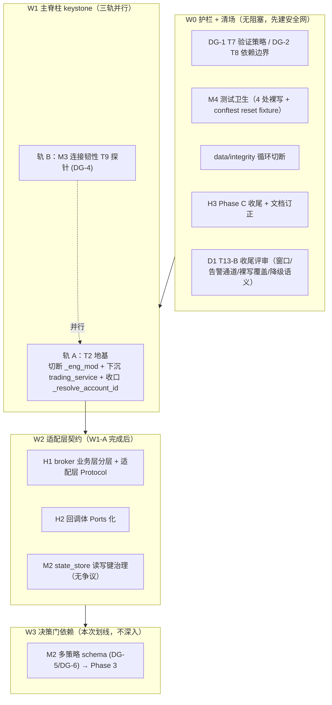

# quanter 技术债综合治理总纲设计

> 本 spec 是 wayfinder 流程的「总纲」：对债务点 + 横切护栏，给出**统一架构裁决 + 依赖编排 + file 级接缝 + 决策门 + 验证手段**。
> 终态产物 = 本 spec + 经 writing-plans 生成的每个工单实施计划。执行者照计划可做到底——**除非撞到本 spec 标注的「🚪 决策门」**。
> 本 spec **不改代码**；代码改造由后续实施计划落地。

> ⚠ **v2 修订缘由（code review 发现）**：v1 把 T13-B 当「待做」纳入 W1-C，实际 T13-B 已于 `31304e9f`（2026-08-11 23:07）全量合并 master；v1 §3.3.3 混淆 write-side / fetch-side 两类守卫；v1 §3.3.4 降级语义与已合并决策冲突。本版按现行代码重写 data 完整性段。

---

## 0. 范围、约束、统一根因、决策门清单

### 0.1 治理点清单（本 spec 覆盖）

| ID | 严重度 | 债务点 | 现状 | wayfinder | 波次 |
|---|---|---|---|---|---|
| H1 | High | broker/qmt.py 业务层堆补丁（1540 行） | 业务补丁与连接层混在同一类 | T2 | W2 |
| H2 | High | **broker 回调体硬编码**（trading→broker 单向；回调副作用未抽象） | 见 §0.6 单向债澄清 | T2 | W1-A/W2 |
| H3 | High→**Low（降级）** | Phase C plan 未升格（文档过时，实际已完成 ~90%） | save_plan/confirm_plan 已删+审计守卫 | T6 | W0 |
| M1 | Medium | 双向耦合 trading↔data(4/2)、trading→presentation(5) | trading_service 位置错配 + data/integrity 真循环 | T1 follow-up | W0/W1-A |
| M2 | Medium | state_store SSoT 半成品（读写键坑） | 7 表齐，多策略硬编码 | T6 | W2/W3 |
| M3 | Medium | 连接韧性 health_guard 无主动探针 | 生产零调 query_account_status | T9/T10/T11 | W1-B |
| M4 | Medium | 测试卫生：全量跑隔离污染源 | 4 处 breaker 裸写 + conftest 无 reset | 工程债 | W0 |
| D1 | Critical→**收尾** | data 完整性检测本体 | **✅ T13-B 已合并（31304e9f）**；剩未决见 §3.3 | T13-B | W0（收尾） |
| 护栏 | 横切 | T7 验证策略 / T8 依赖边界 | 待定 | T7/T8 | W0 先定 |

### 0.2 硬约束（CLAUDE.md + MAP，不可违背）

1. 全中文 + 像素级注释（含 Why）。2. Karpathy 极简（纯标准库 + Protocol/ABC，拒 DI/事件总线/ORM/重型黑盒）。3. 量化风控拷问（反前视/NaN/除零/时区/部分成交；多账户资金隔离是实盘生命线）。4. 演进优先于 live + 渐进式（禁大爆炸重写）。5. **行为等价是红线**（状态机 #5 / 数据路径 #3 不变形）。

### 0.3 统一根因（设计基石）

`_eng_mod` 反查（T2 阻塞）+ `trading_service.py` 位置错配（M1）+ `_resolve_account_id` 四处复制 + 回调体硬编码（H2）——同一反模式的不同症状：trading 内部 concern 散落错误模块，靠 lazy import 规避循环依赖，每次外迁都把反查带出去。**统一治疗**：先建干净模块拓扑，再用 Ports/Protocol 显式注入替代 lazy 反查。

### 0.4 文档订正（勘察实证，须同步 `06-tech-debt.md`）

1. **H3 降级**：`06-tech-debt.md:70` 与事实相反——`save_plan`/`confirm_plan` 已删（`trading_plan.py:132-137`），`audit_ssot.py:79-84` + `test_ssot_static_guard.py:59-64` BANNED 守卫已设，生产写入已切 DB（`eod_plan.py:202-229`）。H3 → Low 收尾。
2. **D1/T13-B 订正**：`06-tech-debt.md:61` 称「L2 scan gate + L3 自动补采仍欠（T13-B）」——**已过时**。T13-B 已合并（`31304e9f`）：scan gate 接 `pipeline_then_eod:155-156`、每周全扫 `engine.sched` cron（`engine.py:557-562`）、scan→repair 异步闭环 + 配额 + 熔断 + 限频 + 超时全落地。仅剩 L1 覆盖面 deferred（3 处裸写入口，见 §3.3.3）。
3. **M1 边权订正**：`02` 文档记 `trading↔data 3/2`、`trading↔presentation 2/3`，实跑 `trading→data 4`、`trading→presentation 5`、`data→trading 2`、`presentation→trading 3`（T1 把 lazy import 带到外迁子模块）。复核跑 #02 文末脚本同步。
4. **M4 污染源订正**：`06-tech-debt.md:79` 称「污染源未定位 / 排查模块属性裸写入」。实证：模块属性裸写入 0 命中；真污染源 = 测试**裸写 breaker 内部状态**（`_state`/`_failure_count`）无 finally（见 §2.3）。

### 0.5 决策门清单（我给推荐 + 对抗推演；推进对应工单前需你拍板）

| 门 | 决策 | 我的推荐 | 阻塞 |
|---|---|---|---|
| 🚪 DG-1 | T7 验证口径 | 四层验证（单元/契约/端到端/双跑）+ 性能基线 | 全程 |
| 🚪 DG-2 | T8 依赖边界 | 严守极简，适配层 importlib 不引框架 | 全程 |
| ✅ DG-3 | data scan 窗口口径 | **已裁决（用户）：日级全扫有意**。full-history ⊇ 80 天下限，满足「至少 80 天」要求。weekly backstop 保留——用途不同（daily=自动 repair 受配额 50 段；weekly=全量 report 人工补，catch 配额外缺口），非纯冗余。80 天 lookback 实证降级为文档注记（非 gating） | W0 收尾 |
| 🚪 DG-4 | T9 探针 + 阈值 N | query_account_status；连续 N 次判僵死；N 待你 qmt_probe CSV | W1-B |
| 🚪 DG-5 | T6 plan→SQLite | 不重启（plan 已在 trade_event 表）；解锁 JSON 窗口关闭 | W0/W3 |
| 🚪 DG-6 | T3 多账户隔离 | 本次划线；推荐软隔离+预留硬隔离路径 | W3 |
| ✅ DG-7 | T13-B 降级语义 | **已裁决（用户）：不推翻**——W0 实施计划按对齐已合并「scan FAIL 不阻断 eod」写。理由见 §3.3.5 | W0 收尾 |

### 0.6 单向债澄清（H2 表述订正）

`#02` 把 trading↔broker 标「4/3 双向」。勘察实证：**import 边是单向的**——trading→broker 4 文件调 gw 接口；broker→trading 的「3」是**回调注入**（`broker/qmt.py:1205 set_order_update_callback` + `_process_order_update:1266-1292` 投递到注入的 callback），**broker 不 import trading**。所以 H2 的真债不是「双向耦合」，而是 **broker 回调体（`trading/order_state.py:handle_order_update`）的副作用依赖未抽象**——函数体内硬编码 `_eng_mod` 反查 + state_store 直调 + trading_service + notifier。H2 因此改名「broker 回调体硬编码」，与 H1（broker 业务层堆补丁）正交。

---

## 1. 治理架构总览（波次 + 依赖）

**编排**：W0 必先（护栏 + M4 是 T2 重构 ~200 处 patch 迁移的安全网）；W1 两轨并行（T2 keystone 不阻塞也不被阻塞于 M3）；W2 依赖 W1-A；每波次合并前必过 DG-1 验证门。**D1（data 完整性）本体已合并，只剩 W0 收尾评审，不再占 W1 独立轨。**

---

## 2. W0 护栏 + 清场

### 2.1 DG-1：T7 验证策略

四层验证：L1 单元（~1684 测试）/ L2 契约（新，适配层 Protocol conformance）/ L3 端到端（e2e_long_cycle 4.9min，每波次合并前）/ L4 双跑对比（新，重构前后同输入 diff，W1-A/W2 必用）。性能基线（新）：回测速度/信号扫描/tick 延迟存 `docs/architecture/perf-baseline.md`，CI 守 10% 退化。对抗推演：双跑对「隐式依赖时间/随机」场景可能假绿 → L3 不可被 L4 替代，互补。

### 2.2 DG-2：T8 依赖边界（写成 ADR，约束所有工单）

基线：纯标准库 + Protocol/ABC/dataclass。适配层 T2 纯标准库可实现（插件发现 `importlib`/`entry_points`；配置 `dataclass`+dict；钩子 Protocol methods）。多账户硬隔离用标准库 `multiprocessing`。**绝不引入**：重型量化黑盒/魔法 DI 容器/隐式事件总线/ORM。可引入清单暂空，每提候选必答「纯标准库为什么不行」。

### 2.3 M4 测试卫生（4 处裸写点 + fixture 补全）

**现状**（勘察实证）：污染源 = 测试裸写 breaker/limiter 单例内部状态无还原。根因：根 `tests/conftest.py` 有 **3 个 autouse fixture**（`_no_production_log_leak` L13 / `_isolate_trade_env` L154 / `_isolate_job_ledger` L162）+ collection 前钩子 `_install_fake_xtquant`（L40，非 fixture）+ 非 autouse `tmp_db`（L174）——**无一重置 resilience 单例**。

**4 处裸写点**（v1 漏第 4 处，订正）：

| # | 位置 | 后果 |
|---|---|---|
| 1 | `tests/test_fetcher_resilience.py:32-33` 入口 reset 后**无 finally**，断言 OPEN 即结束 | `tushare_breaker` 跨用例留 OPEN |
| 2 | `tests/test_fetcher_resilience.py:108-109` 同上 | `fred_breaker` 留 OPEN |
| 3 | `tests/test_akshare_client.py:107-108` 直接置 OPEN 无清理 | `akshare_breaker` 留 OPEN 60s |
| 4 | `tests/test_sync_data_lake.py:109-110` 入口 reset 无 finally | 当前干净（fetch_qfq 空路径不触发 record_failure）但**脆弱**，行为变更即污染 |

**治疗**：① 4 处裸写改 `try/finally` 或 `monkeypatch.setattr`；② 根 conftest 加 autouse fixture `_reset_resilience_singletons`（函数 scope），每用例前 reset `data/resilience.py` 全部单例（`tushare_rate_limiter_basic/special`/`tushare_breaker`/`fred_*`/`akshare_*` 的 `_state=CLOSED`/`_failure_count=0`/`_tokens=capacity`）——治本；③ 删 `tests/trading/test_engine.py:855` 死代码（`state_store._DEFAULT_DB_OVERRIDE` 幽灵属性）。

### 2.4 data/integrity 循环切断（M1 真债②）

- `data/integrity.py:133 → trading.calendar.fetch_trade_cal` 是真函数级循环。治疗：`fetch_trade_cal`/`expected_latest_trade_day` 下沉到 `data/calendar.py`，`trading/calendar.py` 反向 import（改动最小）。
- `data/tools/run_data_check.py → trading.state_store + trading.calendar`（调度脚本反查）：整体迁 `ops/run_data_check.py`（与 data_pipeline 同位），方向变合理。
- 验证：跑 #02 扫描脚本，data→trading 边权 2→0。

### 2.5 H3 Phase C 收尾（快赢）

1. **C2d**：`experiment/cli.py:53 _load_all_plans` 仍扫 plan_*.json（叶子层禁 trading import 回退）。治疗：经窄接口（experiment 定义 `PlanReader` protocol，上层注入 DB 读取 callable）。
2. **JSON 回退窗口关闭**（DG-5 不重启的后果）：`trading_plan.py:119-129`，关闭前确认 legacy shim 仅测试用。
3. **_resolve_account_id 收口**：四处复制（`engine.py:332`/`eod_plan.py:74`/`veto_plan.py:45`/`trading_service.py:494`）→ 抽 `trading/account.py` 单源。**并入 W1-A**（切 _eng_mod 时同步最经济）。
4. 订正 `06-tech-debt.md`（§0.4 四处）。

### 2.6 D1：T13-B 收尾评审（🚪 DG-3 / DG-7）

T13-B 本体已合并，收尾评审 5 项（详见 §3.3）：① scan 窗口口径实证（DG-3）；② `filter_universe_by_continuity` 接告警通道；③ **T13-A 未决发现 P1/P2/P3**（shibor 写误伤 / select_keys KeyError / 双轨收口残留）；④ 降级语义决策（DG-7）。**①③ 是 scan gate 信噪比的前置——不修则 scan 闭环刚建就被 shibor 假缺口刷屏。** P2/P3 与 P1 同处 sync_cli/config 邻域，一并 W0 收尾（用户强烈建议至少 P1 入 W0；P2/P3 同邻域，顺带成本极低）。

---

## 3. D1：T13-B 已合并现状 + 收尾

> T13-B Wave B（scan→repair 闭环）已合并 `31304e9f`。本章只刻画现状 + 收尾项，**不重建闭环**。

### 3.1 已实现现状（`31304e9f`）

| 项 | 实现 |
|---|---|
| scan gate | `pipeline_then_eod`（`pipeline.py:60`）freshness（`:125`）后调 scan（`:155-156`） |
| 每周全扫 | `engine.sched` 周六 02:00 cron `_weekly_scan`（`engine.py:557-562,830-856`） |
| scan 区间 | **全历史**（`scan_integrity.py:74-80`，since/end 缺省 = lake 全期） |
| scan→repair 闭环 | 异步 repair 子进程（`pipeline.py:165-169`）+ 配额 `MAX_REPAIR_SEGMENTS=50`（`repair_gaps.py:50`）+ 熔断 sidecar（`:55-80`）+ 限频（`sync_daily_incremental.py:60` `_fetch_paged` 每页 acquire）+ 超时 1800s（`:46,134`） |
| 降级语义 | scan FAIL **不阻断 eod**（`pipeline.py:152,171` 注释，blueprint §2.3）：告警 + 入补采队列 |

### 3.2 收尾项 ①：scan 窗口口径（✅ DG-3 已裁决：日级全扫有意）

- **裁决**：日级全历史扫描 = **有意**（用户确认）。full-history ⊇ 80 交易日下限，满足「至少 80 天」要求——无需收窄。
- **weekly backstop 保留（非冗余）**：`_weekly_scan`（engine.sched 周六 cron）虽与日级全扫同覆盖全期，但**用途不同**——
  - daily scan = 触发**自动 repair**（受 `MAX_REPAIR_SEGMENTS=50` 配额 + 熔断约束）；
  - weekly scan = **FAIL 写全量 report 人工补**（catch daily 配额 50 段覆盖不到的缺口，T13-B commit msg 明示「周期 backstop，FAIL 写报告人工补」）。
  - 两层互补：日级自动修小缺口 + 周级人工兜底大缺口。**保留 weekly，不删。**
- **80 天 lookback 实证降级**：原 DG-3 子项「实测颈线法 max lookback 确认 80 够」——既然全扫，full-history trivially ⊇ 任何 lookback，实证不再是 gating，降级为文档注记（W0 可选：在 `data/integrity.py` docstring 注明 scan 窗口语义 = 全历史，与策略 lookback 解耦）。
- **噪声风险**：全扫可能产旧标的退市缺口噪声——已由 scan 区间边界 `[actual_min, actual_max]`（`find_gaps:280-282`，标的上市前/退市后不要求）+ repair 配额/熔断自然抑制。若 W0 实测噪声过高，再议是否给 daily scan 加 `since=最近N天` 的窄窗选项（不改默认全扫）。

### 3.3 收尾项 ②③④：守卫覆盖 / 告警通道 / 降级语义

#### 3.3.1 ~ 3.3.2（scan gate / 闭环）—— 已实现，见 §3.1

#### 3.3.3 守卫覆盖（v1「确认覆盖」错句，订正）

> v1 原文「repair_gaps 裸调 pro 已在 T13-A 改走 `_fetch_with_guard`（确认覆盖）」——**双重错误**，订正：
> - T13-A 的守卫是 **write-side** `assert_safe_overwrite`/`safe_overwrite`（`repair_gaps.py:35,261` 已接入），**不是** fetch-side。
> - fetch-side 限频守卫 = `_fetch_paged`（T13-B，`sync_daily_incremental.py:47`）每页 acquire basic 桶；repair_gaps 经 `_fetch_paged` → `tushare_sync._fetch_with_guard`（`tushare_sync.py:72`，fetch-side quota/breaker）。注：`_fetch_with_guard` 存在（非不存在），但与 T13-A write-side 守卫是两类，v1 混淆。
> - 「确认覆盖」**不实**：T13-A L1 覆盖面 **deferred**，3 处写入口仍裸 `to_parquet`（`06-tech-debt.md:61` 声明 deferred，实测属实）：

| 裸写入口 | 位置 |
|---|---|
| macro_credit（含 shibor/shrzgm） | `sync_macro_credit.py:212 df.to_parquet(out)` |
| sync_data_lake build_multiindex | `sync_data_lake.py:158 big.to_parquet(...)` |
| sync_data_lake shard 写 | `sync_data_lake.py:181 df.to_parquet(shard)` |

**治疗**：3 处接入 write-side `safe_overwrite`（与 daily 写入口同口径）。

#### 3.3.4 收尾项 ③：T13-A 未决发现 P1/P2/P3

T13-A 评审遗留三项未决发现，同处 data sync 写入口/CLI/config 邻域，一并 W0 收尾：

| 项 | 事实（file:line · 2026-08-11 基准） | 治疗 |
|---|---|---|
| **P1** shibor/macro 窗口写误伤 | `sync_macro_credit.py:212` 窗口增量写被 write-side 守卫每日 `WriteGuardError` → 永久断更（memory 记录，评审后未修复） | 守卫语义区分「正常小窗口增量」vs「残片覆盖」（基线环比口径调整，或该写入口走专用 narrow 守卫）。**scan gate 信噪比前置**——不修则 scan 每天被 shibor 假缺口刷屏 |
| **P2** select_keys 顺序 KeyError | `data/sync_cli.py:62 select_keys` 对退役 key（如 `"daily"`）`TUSHARE_DATASETS[k]` 取值顺序致 KeyError（`:73-75` 已部分修：过滤 `_unavailable` + `k in TUSHARE_DATASETS`，注释标 "review P2"） | 复核修复是否完整（退役 key 全路径不崩）；补回归测试 `--keys daily --quota basic` 不 KeyError |
| **P3** 双轨收口残留 | daily 双轨收口（T13-A 删 `TUSHARE_DATASETS["daily"]`）留 `_unavailable` 标记 / 退役 key 引用（`sync_cli.py:75`），非干净清除 | 决策：退役 key 是标记 `_unavailable` 保留（向后兼容）还是从 config 干净删除；统一口径，补守卫测试防再生 |

**注**：P2/P3 的 file:line 已实测定位（非 memory 转述）；P1 的 `WriteGuardError` 触发链需在 W0 实施时确认（守卫基线环比口径 vs 窗口增量行数）。三项均小，归 W0 D1 收尾工单 `d1-t13b-tail`。

#### 3.3.5 收尾项 ② + ④：filter 告警通道 + 降级语义（✅ DG-7 已裁决：不推翻）

**filter_universe_by_continuity fail-closed 实证**（`data/integrity.py:366-413`）：
- **per-symbol fail-closed**：`if result.ok: clean.append(sym)` else 跳过（`:405-412`）——窗口含未解释漏采的标的**不进 scan_live/策略**。这是「策略基于完整数据输出」的真正保证。
- **global fail-open 洞**（`:389-392` docstring 红线）：`trade_days` 空集（加载失败/测试降级）→ `expected=∅ → missing=∅ → ok=True → 全放行`。这是 T5 所称「fail-open 窗口 gate」的真义——**不是** per-symbol fail-open，而是上下文加载失败的兜底放行。

**告警通道（②）**：当前被过滤标的仅 `_log.warning`（`:409`），无钉钉/CRITICAL 通道。治疗：过滤事件接 `infra.notifier`（计数 + 节流，防全市场过滤刷屏），让残数据标的被过滤**有声**。

**降级语义（④ / DG-7，已裁决：不推翻）**——对齐已合并「scan FAIL 不阻断 eod」。理由（用户已确认）：
1. 「策略基于完整数据」由 `filter_universe_by_continuity` **per-symbol fail-closed** 保证——残窗口的标的被剔除，策略不基于其产信号。scan+repair 的价值是**主动**发现+修复缺口（让过滤少触发），不是第二道阻断门。
2. 全盘残片（T12 式 1020万→3200行）是**不同失效模式**，已由 T13-A write-side 守卫 + freshness 行数骤降覆盖。让 continuity scan 兼任全盘阻断会**重复那一层**，且一只标的的旧历史缺口会冻全账户全策略——blast radius >> C-1。
3. 即便残片场景，「不阻断」也优雅降级：scan 发现海量缺口 → repair 触熔断 → eod 跑 → filter 剔除大部分标的 → 近空 universe → **少信号，不是错信号**。
4. 仅剩的洞 = filter 的 **global fail-open**（上下文加载失败时全放行）。治疗是给 filter 上下文加载失败接 CRITICAL 告警（与 ② 告警通道同链），**不是**让 scan 全盘阻断。

> **推翻选项（已驳回）**：若未来要改为「scan 全局 FAIL → pre_open 阻断」，须 ① 明确标注推翻 T13-B 既定决策（blueprint §2.3）；② 论证「历史缺口与当日交易无关」在此为何失效；③ 评估整盘不交易代价（全账户全策略 > C-1 影响面）。当前上述论证不成立（见上 1-4），**用户已确认不推翻**，W0 实施计划按对齐已合并语义写。

---

## 4. W1 主脊柱 keystone（两轨并行）

### 4.1 轨 A：T2 地基（keystone——治统一根因）

**目标**：切断 `_eng_mod` 反查 + 下沉 `trading_service.py` + 收口 `_resolve_account_id`。一次手术同时治 H2 回调体硬编码 + M1 真债① + _resolve_account_id 复制。

#### 4.1.1 切断 `_eng_mod` 反查（128 处 / 19 符号）

> v1 计数 72/17，订正：**128 处 `_eng_mod` 引用（含 import 语句 + 别名绑定 + 注释；纯运行时属性访问 ~80 处）/ 19 不同符号**。19 符号分布（grep 实测）：

| 符号 | 次数 | 符号 | 次数 |
|---|---|---|---|
| `_state_store` | 20 | `qmt_market_data` | 3 |
| `_mode` | 11 | `_trading_days_between` | 3 |
| `_resolve_account_id` | 9 | `_seq_for_real_oid` | 3 |
| `_submit` | 6 | `_last_quote_blackout_alert_ts` | 3 |
| `_alert_critical` | 5 | `_cancel_all_open_orders` | 3 |
| `place_take_profit` | 4 | `calendar` | 2 |
| `get_gateway` | 4 | `_pre_open_impl` / `_order_state_to_db` | 2 各 |
| 其余 | — | `decide_exit`/`_scan_expired_positions`/`_close_expired_positions`/`_QUOTE_BLACKOUT_ALERT_INTERVAL_S` | 1 各 |

EnginePorts 仅注入 3 依赖（gate/whitelist_add/whitelist_clear），解耦度低。硬约束：① **~200 处 `patch("trading.engine.X")` 测试点**需同步迁移；② 循环 import 规避（lazy 根本动机）；③ `_last_quote_blackout_alert_ts`（`engine.py:304`）模块级可变状态。

**差异化注入治疗**：

| 符号类型 | 例 | 治疗 |
|---|---|---|
| 无状态纯函数/常量 | `_trading_days_between`/`calendar`/`qmt_market_data` | phases/ 顶部直接 import 物理定义模块（它们是叶子，不反查 phases） |
| 有状态服务 | `_state_store`/`get_gateway`/`_submit`/`_alert_critical`/`_mode` | 扩 EnginePorts 注入 |
| 模块级可变状态 | `_last_quote_blackout_alert_ts` | 收口到小类经 ports 注入，单一真相源 |
| phases 内部互调（环） | `place_take_profit`/`_seq_for_real_oid` | 物理真身在 phases/，直接 import 同包子模块 |

测试 patch 迁移（最重工作量）：~200 处 → 迁新物理路径或经 ports 注入 mock；机械迁移 + L4 双跑，每批跑 e2e_long_cycle。**这是 M4 必须先做的根本原因。**

#### 4.1.2 下沉 trading_service.py（M1 真债①，最高 ROI 单点）

`presentation/server/services/trading_service.py` 承担网关单例+下单/持仓/归因（trading 内部 concern）却放 presentation L5。**8 处 lazy import 全指它**（`engine.py:351,369,1201`/`eod_plan.py:238`/`order_state.py:478`/`io/orders.py:43`/`post_close.py:237,344`）。治疗：整体下沉 `trading/gateway_service.py`；8 处 lazy import 改指（循环随 _eng_mod 切断解除可转顶层）。收益：trading→presentation 边权 5→0，双向变单向。

#### 4.1.3 收口 _resolve_account_id（H3 follow-up）

抽 `trading/account.py` 单源；四处复制改 import；注释锁解除。

**轨 A 验证**：#02 扫描 trading→presentation 边权→0；`_eng_mod` grep 0 命中；e2e_long_cycle 全绿；`pytest tests/trading/` 全绿。

### 4.2 轨 B：M3 连接韧性（T9/T10/T11）

**盲区根因**：`_health_guard`（`engine.py:821-963`，60s/轮）判定仅依赖 `_connected` 布尔 + `is_client_ready()`（纯目录存在性）。客户端重启中/启动失败/假死时两者均"正常"→ no-op → 废单撞柜台才暴露。**生产零调 query_account_status**；`query_asset` 失败/正常均返 `{}` 不可作僵死判据。`qmt_probe_smoke.py`（258 行）完整但未接生产。

- **T9 探针（DG-4）**：gw 封装层新增 `probe_account_status()` 暴露 `query_account_status()`（无参同步，带超时+线程池）；嵌入 `_health_guard` 第②步前，`_connected=True` 时先探针，连续 N 次失败判僵死（置 `_lock_down`→触发 `_reconnect`），**不另起 watchdog**。🚪 N 待你 qmt_probe CSV（S1-S4 四态）实证，推荐初始 N=3。对抗推演：探针假死→必带超时；瞬时抖动→"连续 N 次"非单次。
- **T10 嵌套父子**：先实证 schtasks→bat→python 是否真双起（C-5/C-7 后可能已不发生）。不发生→降级防御性 PID+PPID 或关闭（反过度设计）。
- **T11 启动重试**（依赖 T9）：connect 两轮 attempt 间加指数退避（2/4s）+ 熔断阈值（连续 M 次 -1→CRITICAL）；记每次 -1 的 status_msg。

---

## 5. W2 适配层契约（W1-A 完成后）

### 5.1 H1 broker 业务层分层 + 适配层 Protocol

**澄清**：tech-debt 称"串通挂撤/拒涨停"**不在 broker/**（grep 0 命中），在 `phases/pre_open.py` + `critical.py` + `compute/risk.py`。broker/qmt.py 1540 行真债 = 业务补丁层（撤单确认 L952-985 / 惰性同步 L988-1042 / GC L1240-1263 / 重连策略 L1294-1369）与连接层混在同一类。**T4 已裁定连接层不重构**；这些补丁是**正确行为的事故修复**，不是 bug。

**治疗（保守分层，不重写逻辑）**：① 定义 `BrokerProtocol`（submit/cancel/query_*/sync_positions + 钩子，Protocol）；② 按四层物理分文件（qmt_connection/qmt_io/qmt_business），**逻辑只搬位置+加接缝注释，不改**；③ `set_order_update_callback`（L1205）干净控制反转，保留为契约一部分。对抗推演：分文件触发连带修改→re-export 兼容块（同 T1）+ 分批双跑。

### 5.2 H2 回调体 Ports 化（单向债，见 §0.6）

回调注入端口已抽象（broker 不 import trading），债在回调体 `order_state.py:handle_order_update`（L306+）硬编码 _eng_mod 反查 + state_store 直调 + trading_service + notifier。

治疗（依赖 W1-A）：① 回调体依赖经 Ports（engine 经 W1-A 扩展的 EnginePorts 拿 state_store/gateway/notifier）；② 写 DB（`insert_fill`/`apply_fill_to_position`/`insert_trade_event`，L399-540）经 ports.state_store；③ 钉钉经 ports.notifier；④ broker 侧 `_on_disconnect_fatal`/`_reconnect` 的 `infra.notifier` 反向延迟 import（L1312-1362）也经注入收敛——broker 回归干净叶子。**收益**：broker 与 trading 真正解耦，适配层可换 broker（多经纪商地基）。

### 5.3 M2 state_store 读写键治理（无争议部分）

- **actual_sid 单 SSoT**：选 DB `account.session_id` 为唯一真相源（L3 决议），engine_session.json 降为运行态快照，trading_supervisor 只读 DB；删 session_id 死键兼容。
- **stoploss 三 map 语义分离**：抽 `StopLossContext` dataclass 收口 stop_prices/monitor_ctx/pending_ctx（stop/cancel_on/neckline 显式分字段）；**若 W2 实施时发现抽取会改 _stoploss 状态机语义（违反行为等价红线），降级为仅加命名注释+docstring 锁，不强抽**。
- **veto 守卫单点**：抽 `state_store.is_vetoed()`，三处复制（`eod_plan.py:225`/`_legacy_plan_io.py:89,122`）改调它。

---

## 6. W3 决策门依赖（本次划线，不深入）

M2 多策略 schema：多账户已隔离（account_id 全表）；多策略硬编码单策略——strategy 散落 4 处（`account.strategy_name`/`fill.strategy`/`position.strategy`/`trade_event.meta` 字面"neckline"），无 strategy_id 主键/strategy 表/FK。
- DG-5：不重启 plan→SQLite。DG-6：推荐软隔离+预留硬隔离路径，须 adversarial 推演。演进方向：新建 strategy 表 + 各表加 strategy_id FK。衔接 Phase 3（T3）。

---

## 7. 与优化计划交叉（`docs/2026-08-03-backtest-strategy-review-and-agent-loop.md`）

> 本 spec 治理的是**架构债**；优化计划治的是**回测可信度/口径**。两者正交但有交叉点，避免重复或冲突。

| 优化计划项 | 与本 spec 的关系 |
|---|---|
| **P0-1** 止损按目标价完美成交未建模跳空/跌停 | 回测保真，属优化计划自治；**不纳入**本 spec（但 H1 broker 业务层含真实止损执行逻辑，W2 不动算法） |
| **P0-2** 零滑点/零部分成交/MockBroker 未接入 | 回测保真；**不纳入**。注：H1 适配层 Protocol 化后，MockBroker 可作适配层第二个实现（W2 间接赋能，但不在本 spec 范围） |
| **P0-3** 日 K 内事件顺序未量化 | 回测保真；**不纳入** |
| **P1-1** max_drawdown vs 净值曲线不同源 | 口径；**不纳入**（M2 state_store 不动盈亏口径） |
| **P1-2** discovery≠主回测≠实盘口径 | 口径；**不纳入**（颈线法策略口径，非架构债） |
| **P1-3** 快照指纹不含数据内容 | **交叉**：与 D1 data 完整性同源（数据可信）。D1 scan gate 补「连续性」维度，快照指纹补「内容哈希」——互补不冲突，各自推进 |
| **P1-4** replay 单 T 异常静默 | **交叉**：与 M4 测试卫生同精神（失败不静默）。各自推进 |
| **P1-5** 策略实例一次一跑契约 | 策略层；**不纳入** |
| **P2** 细节问题 | 排期修复；**不纳入** |

**结论**：本 spec 与优化计划**基本正交**，唯 P1-3（数据内容指纹）与 D1（连续性 scan）互补、P1-4（异常不静默）与 M4 同精神。各自工单推进，无冲突。

---

## 8. scope 显式声明：pre_open P0 残留的去留

**pre_open 相关 P0 残留**（来自 `live-readiness-design.md` P0-1~P0-5 + `account_daily.start` 漏采）：

| 项 | 状态 | 本 spec 去留 |
|---|---|---|
| `account_daily.start` 漏采 → C-1 熔断基线裸奔 | **已修**（`ae57b0e4`/`5eee9302`，pre_open 基线告警 + T-1 close 兜底） | **不纳入**（已闭环） |
| live-readiness P0-1 scan_live entry=颈线+ATR | 策略层 | **不纳入**（颈线法口径，非架构债） |
| live-readiness P0-2 pre_open 过滤超期（max_wait） | 已实施 | **不纳入** |
| live-readiness P0-4 post_close 扫超期+pre_open 平 | 已实施 | **不纳入** |
| live-readiness P0-5 _eod cooldown 去重 | 已实施 | **不纳入** |

**声明**：pre_open P0 残留属 **live-readiness / 策略口径**范畴，**不在本架构债治理 spec 范围内**。本 spec 只在与 M2（account_daily 作为 SSoT）/ D1（pre_open 前的 scan gate）交叉处提及，不深入。若 pre_open 有新发现的架构级残留（如基线告警 helper 收口的 follow-up），归入对应工单（M2/D1），不单列。

---

## 9. 验证与回归防护 / 10. 风险与回滚

**每波次合并门**：L1 全量绿 + L3 e2e_long_cycle 绿 + L4 双跑行为等价 + 性能无 >10% 退化。重构专用：W1-A（~200 patch 迁移）+ W2 必用 L4。CI 绿门防"既有红"积累。

**主要风险**：W1-A 改坏交易行为（中/高）→ L4 双跑每批 + 小批 + re-export + revert 单批；循环 import 死锁（中/中）→ 逐模块 import 验证；T9 探针误判（中/中）→ N 待 CSV + 超时 + "连续 N 次"；D1 scan 旧缺口噪声（低/低）→ 窗口收窄（DG-3）。回滚总则：每波次独立 PR，小步提交，未达 DG-1 不合并。

---

## 11. 现状重验纪律（META，v2 新增）

> v1 错把 T13-B 当「待做」，根因 = 信任 `06-tech-debt.md`（"T13-B 仍欠"）未 re-check git。**教训**：doc 滞后 merges。

**纪律**：本 spec 每个治理点的实施计划 ship 前，必须 **re-verify 现行代码状态**（git log + 关键 file:line），不能只信 doc/ticket 文本。CLAUDE.md memory 准则：doc 命名的 file/function/flag，推荐前先确认仍存在。本 spec §9 附录的行号是 **2026-08-11 基准**，实施时以当时代码为准。

---

## 12. 工单拆解映射（spec 批准后由 writing-plans 生成）

| 波次 | 治理点 | wayfinder | 实施计划（待生成） | 决策门 |
|---|---|---|---|---|
| W0 | T7/T8 | T7/T8 | t7-validation / t8-dependency | DG-1/DG-2 |
| W0 | M4 测试卫生 | 工程债 | m4-test-hygiene | — |
| W0 | data/integrity 循环 | T1 follow-up | data-cycle-cut | — |
| W0 | H3 Phase C 收尾 | T6 | h3-phase-c-tail | DG-5 |
| W0 | D1 T13-B 收尾 | T13-B | d1-t13b-tail（窗口/告警/裸写/降级） | DG-3/DG-7 |
| W1-A | T2 地基 | T2 | t2-keystone | — |
| W1-B | M3 T9 探针 | T9/T10/T11 | t9-probe | DG-4 |
| W2 | H1 broker 分层 | T2 | h1-broker-layering | — |
| W2 | H2 回调体 Ports | T2 | h2-callback-ports | — |
| W2 | M2 读写键治理 | T6 | m2-key-governance | — |
| W3 | M2 多策略 schema | T6/T3 | （Phase 3，划线） | DG-5/DG-6 |

---

## 13. 附录：勘察事实索引（file:line · 2026-08-11 基准）

> 行号基准 = 2026-08-11（含 `31304e9f` T13-B 合并后）。实施时 re-verify。

### broker/qmt.py（H1/H2）
- `set_order_update_callback` L1205-1213（回调注入端口·干净接缝）· `_process_order_update` L1266-1292（出口 L1289）
- `_confirm_cancelled` L952-985 / `_sync_orders_if_stale` L988-1042 / `cleanup_orders` L1240-1263 / `_on_disconnect_fatal` L1294-1319 / `_reconnect` L1321-1369
- `connect` L568-680 / `is_client_ready` L416-446 / `query_asset` L755-818 / `on_disconnected` L1377-1391

### engine.py / phases / order_state（W1-A）
- `_health_guard` L821-963 / `_gw_health_gate` L611-637 / `_resolve_account_id` L332-340 / ports 构造 L594-606 注入 L935,1280,1471 / re-export L78-262 / `_last_quote_blackout_alert_ts` L304
- `_eng_mod` 反查 128 处 / 19 符号（分布见 §4.1.1）；`handle_order_update` order_state.py:306（写 DB L399-540）
- EnginePorts ports.py 3 字段（gate/whitelist_add/whitelist_clear）

### data 完整性（D1/T13-B）
- scan gate `pipeline.py:155-156`（freshness `:125`，pipeline_then_eod `:60`）· weekly `_weekly_scan` engine.py:557-562,830-856
- scan 全期缺省 `scan_integrity.py:74-80` · repair 闭环 `pipeline.py:165-169` / 配额 `repair_gaps.py:50` / 熔断 `:55-80` / 限频 `sync_daily_incremental.py:60 _fetch_paged` / 超时 `:46,134`
- **filter_universe_by_continuity** `data/integrity.py:366-413`：**per-symbol fail-closed**（`:405-412`，残窗口标的剔除不进策略）+ **global fail-open 洞**（`:389-392`，trade_days 空集时全放行）· 过滤仅 `_log.warning`（`:409`，**无告警通道** = 收尾项②）
- write-side 守卫 `safe_overwrite`/`assert_safe_overwrite`（repair_gaps.py:35,261 接入）· fetch-side 限频 `_fetch_paged`→`tushare_sync._fetch_with_guard:72`
- **3 处裸写（T13-A deferred）**：`sync_macro_credit.py:212` / `sync_data_lake.py:158,181`
- veto_plan：`trading/tools/veto_plan.py`（line 45 `_resolve_account_id` 复制 / line 77 `veto` / 守卫三处复制 eod_plan.py:225 + _legacy_plan_io.py:89,122）

### 测试卫生（M4）
- 4 处裸写：`test_fetcher_resilience.py:32-33,108-109` / `test_akshare_client.py:107-108` / `test_sync_data_lake.py:109-110`
- 根 conftest **3 autouse fixture**（`_no_production_log_leak` L13 / `_isolate_trade_env` L154 / `_isolate_job_ledger` L162）+ collection 钩子 `_install_fake_xtquant` L40（非 fixture）+ 非 autouse `tmp_db` L174；**无 resilience reset** · 死代码 `test_engine.py:855 _DEFAULT_DB_OVERRIDE`
- resilience 单例：`data/resilience.py` tushare_rate_limiter_basic L282 / tushare_breaker L292

### 双向耦合（M1）
- trading→presentation 8 处 lazy import 全指 trading_service.py（engine.py:351,369,1201 / eod_plan.py:238 / order_state.py:478 / io/orders.py:43 / post_close.py:237,344）
- data→trading 2 处：data/integrity.py:133（真循环）/ data/tools/run_data_check.py:18,91（调度反查）

### 连接韧性（M3）
- single_instance.py:69-108（文件锁+PID，不写 PPID）/ process_topology.py:82-121（无祖先链）/ trading_supervisor.py:140-171（三合一）/ qmt_probe_smoke.py（258 行，未接生产）
